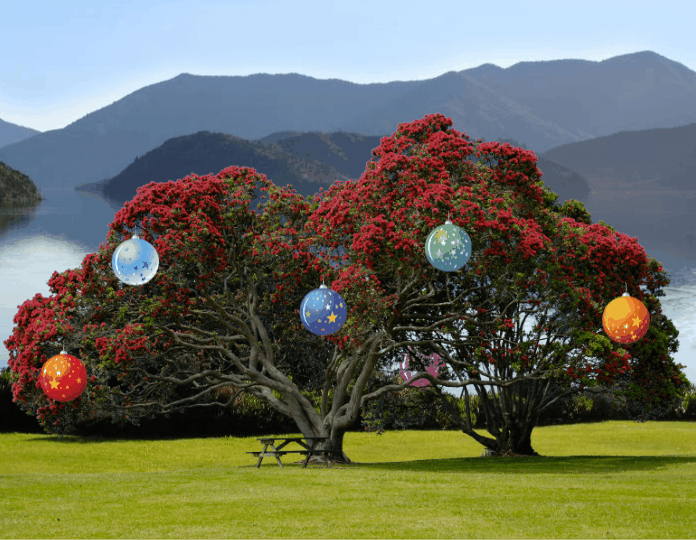

# Web Lab &ndash; CSS Transforms, Transisions, &amp; Animations
In this lab, we continue our coverage of CSS, delving into transforms, transitions, and animations. Proper application of these can really help various elements on your page pop!

## Exercise One &ndash; Transforming baubles
Remember the CSSmas tree from the previous lab?

In this exercise, you'll re-implement Exercise Nine of that lab, where you made the baubles expand when hovering over them with the mouse. However, this time, set the *scale* function of the baubles' `transform` property, rather than directly changing the baubles' width or height. A starting point can be found in the [`ex01`](./exercises/ex01) folder.

Once you've done that, further modify your code such that the bauble moves smoothly between "small" and "large" states. Decide whether it would make sense to use a *transition* or an *animation* for this exercise.

## Exercise Two &ndash; Animated CSSmas tree
This exercise continues on from Exercise One. Here, we will use a CSS `@keyframes` animation to get the baubles to all fall down simultaneously and bounce up and down twice before coming to a standstill. Get the animation to restart each time you hover over the image. The baubles should remain on the ground after the animation is complete. An example of what the completed animation might look like can be seen in the gif below (though the exact timings / bounce distance / etc. are up to you).

**Note:** *All* baubles should animate *at the same time*, whenever you hover over any part of the image. They shouldn't animate individually.

**Hints:**
- Think about how you'd style all your `.bauble` elements to include your animation, but *only* when you're *hovering* over the `#container`.
- Investigate the `animation-fill-mode` property to make the baubles stay on the ground.
- Do you need to set the baubles' initial positions in the `@keyframes`? What happens if you leave the `from { }` section blank?

### Challenge Exercise 2.5
As an extension to Exercise Two, make the baubles stay on the ground at all times when not animating, even when you're not hovering over the image. You should be able to add this functionality with only **one** extra CSS rule, and *without* modifying any of the CSS already written.

## Exercise Three &ndash; An aMAZEing exercise
In the [`ex03/maze.html`](./exercises/ex03/maze.html) file, you will find three Scalable Vector Graphics (SVG) elements embedded in the page. These represent a maze, a figure and a monster. By adding CSS animations within [`maze.css`](./exercises/ex03/maze.css), animate the monster chasing the figure through the maze. You should ensure that:
- Neither the figure nor the monster pass through any of the maze walls
- The figure and the monster use different `@keyframes` for their animations
- The monster gives the figure a slight head start
- The monster should almost, but not quite, catch the figure at the end of the maze