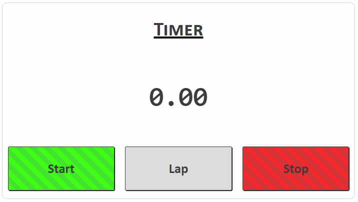
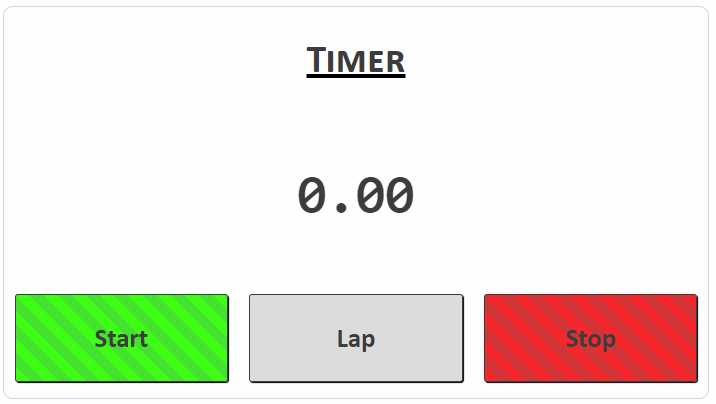

# Web Lab &ndash; JavaScript Functions &amp; Timers
In this lab, we continue our coverage of JavaScript by introducing functions, and more event handling in the form of timer events.


## Obtaining the code
Now that you've obtained a copy of this repository through GitHub Classroom's invite, you have your own private version of this repository (i.e. the one you're looking at now)! To clone this repository onto your machine, click the green `Code` button, make sure `HTTPS` is selected, then click the `copy` button to the right of the web URL to copy its value. Then, clone onto your local machine from a terminal, using the `git clone` command.

If this is the first time you've ever cloned a repository on the current machine, you may be asked to enter your GitHub credentials. The "sign in with your browser" option should work just fine. You may need to enter your GitHub username and password, and / or authorize "git credential manager" to access your account. Perform these steps if asked.

Now, you should have a clone of your repository on your local machine, ready to develop!

Remember to commit and push your work regularly for backup purposes. It's also really good practice to create new branches for each exercise, and merge these into `main` using a Pull Request (PR) when they're complete (as opposed to simply pushing directly to `main` each time). This will get you used to a collaborative workflow style that will come in really handy when working on the final team project this semester!


## Exercise One &ndash; Practice with functions
In this exercise, we will practice writing and calling (invoking) functions. We will complete a simple web app which calculates the volume of a cylinder and a cone based on user input, and displays the results.

To begin, study the contents of the [`ex01`](./exercises/ex01) folder, then perform the following steps:

1. At the marked location in `shape-calculator.js`, add an event listener to the `#btnCalculate` button. The `generateResults()` function should be called when the button is clicked.

2. Study the `getConeVolume()` function, which returns the volume of a cone given its radius and height. The volume of a cone is given by the following formula:

   V = &pi;*r*<sup>2</sup>*h* / 3

   where *r* is the radius of the base of the cone, and *h* is its height. You don't need to modify this function.

3. At the marked location in `shape-calculator.js`, create a function called `getCylinderVolume`. The function should take two parameters - a cylinder's radius and height - and should return the volume of a cylinder with those dimensions. The volume of a cylinder is given by the following formula:

   V = &pi;*r*<sup>2</sup>*h*

   where *r* is the radius of the cylinder, and *h* is its height.

4. At the marked location in `shape-calculator.js`, write a function called `displayShapeVolumes`. The function should take two parameters - the volume of a cone and the volume of a cylinder - and should display those values in the `#cylVolume` and `#coneVolume` `<span>`s, respectively.

5. At the marked location in `shape-calculator.js`, write a function called `displayLargestShapeInfo`. The function should take two parameters - the volume of a cone and the volume of a cylinder - and should display information about the *largest* of those two shapes in the `#resultDetail` `<p>`.

   As an example, if the largest shape is the cylinder, and it has a volume of 20cm<sup>3</sup>, then the paragraph should disply something like: *"The shape with the largest volume is the cylinder, with a volume of 20cm<sup>3</sup>"*.

6. At the marked location near the top of `shape-calculator.js`, complete the web app by calling (invoking) the functions you've just written in steps 2 through 5. Your web app should:

   - Calculate the volume of a cone, given the radius and height entered by the user
   - Calculate the colume of a cylinder, given the radius and height entered by the user
   - Display the volumes of those shapes back to the user
   - Display information about the largest shape to the user


## Exercise Two &ndash; A simple stopwatch
In this exercise, we'll practice use of timer events to create a simple stopwatch in JavaScript.

Begin by studying the contents of the [`ex02`](./exercises/ex02) folder - particularly the `html` and `js` files - then perform the following steps:

1. At the marked location in `timer.js`, declare two variables:
   - A variable named `timer` which will store a timer object we start, so we can stop it when required. Set it to `null` for now.
   - A variable named `elapsedTimeMillis`, which will store the elapsed time of our stopwatch. Set it to `0` for now.

2. Complete the `startTimer()` function. The function should check if a timer is already running (i.e. our `timer` variable isn't `null`). If there's no timer running, then the function should:
   - Set the value of `elapsedTimeMillis` to `0`
   - Display `"0.00"` in the `#timer_face` `<span>`
   - Start a continuous *interval* timer, which will call the `updateTimer()` function every 100ms.

3. Complete the `stopTimer()` function. The function should check if a timer is already runnin. If there *is* a timer running, then the function should stop that timer, and reset our `timer` variable to `null`.

4. Complete the `updateTimer()` function. The function should:
   - Add 100 to the value of `elapsedTimeMillis`
   - Displays the current elapsed, time, **IN SECONDS**, in the `#timer_face` `<span>`. The value displayed should be rounded to two decimal places.

   **Hint:** In the following code, the `numString` variable will have the string value `"3.00"`.

```js
const num = 3;
const numString = num.toFixed(2);
```

5. At the marked location within `timer.js`, add event handlers to the `#btnStartTimer` and `#btnStopTimer` `<button>`s. The `startTimer()` and `stopTimer()` functions respectively should be called when those buttons are clicked.


## Challenge Exercise Three &ndash; Adding to the stopwatch
This exercise is extension material for you to work on once you've completed all other lab exercises. If you don't get round to it during the lab, that's OK. In that case, it's a good idea to come back to it later on in the course, once you're more comfortable with the course content.

**Note:** Support from tutors / instructors on this question is extremely limited, as their focus will be on assisting students with the preceding exercises.

In this exercise, we will extend the functionality of the stopwatch developed in Exercise Two, by adding "pause" and a "lap" features.

### Pause feature
The functional requirements for the pause feature is as follows:
- When the timer is started, the "Start" button's text should change to say "Pause", and its CSS class should change (check the `.css` file for an appropriate option).
- When "Pause" is clicked", its text should change to say "Resume", and its CSS class should change again.
- While paused, the timer's displayed value on the UI should not change.
- While paused, the record of `elapsedTimeMillis` should not change.
- When resumed, the timer should begin updating as usual from wherever it left off.
- When the "Stop" button is clicked, regardless of whether the timer is currently started or paused:
   - The "Pause / Resume" button should switch back to a "Start" button and its CSS class should change as appropriate
   - The timer's displayed value should change to "0.00"

An example of the functionality described above can be seen in the below GIF:



### Lap feature
The functional requirements for the lap feature are as follows:
- A new button should be added to the HTML page, labelled "Lap".
- If the lap button is clicked while the timer is currently stopped or paused, nothing should happen.
- If the lap button is clicked while the timer is started, a *three-second lap timeout* should begin. While the lap timeout is in effect, the timer's UI should not update. However, the `elapsedTimeMillis` should continue to increment in the background.
- When the lap timeout ends, the UI should resume updating as usual. As the `elapsedTimeMillis` would have continued to update in the background, the visible effect to the user would be a jump of around three seconds in the timer value displayed.
- If the lap button is clicked while a lap timeout is already in effect, the timeout should be reset. The timeout should now end three seconds from when the lap button was clicked most recently.

An example of the functionality described above can be seen in the below GIF:



### Tips
This exercise is a *challenge* question. It is intentionally difficult, and completion is intended to demonstrate an exceptional level of understanding of many of the concepts introduced in lectures thus far. As such, you're largely on your own. Having said that, here are a few prompting questions which may help you get started:
- Consider how you can both chunk your new code into appropriate functions, and also *refactor* your existing code to increase understandability and maintainability.
- What kind of timer will you need for the lap feature?
- How will you keep track of whether the timer is paused? Of whether there is a lap timeout in effect?

### Further extension
To further extend yourself, experiment with adding even more features of your own design to the app. Some options include, but are not limited to:
- Add a table to the page which maintains a list of lap times. Whenever the lap button is clicked, the current elapsed time could be added as a row to that table.
- Modify the CSS style of the timer, so that it looks good on both mobile and desktop displays. For example, perhaps on a portrait-oriented mobile device, the three buttons could be stacked vertically, rather than horizontally.
