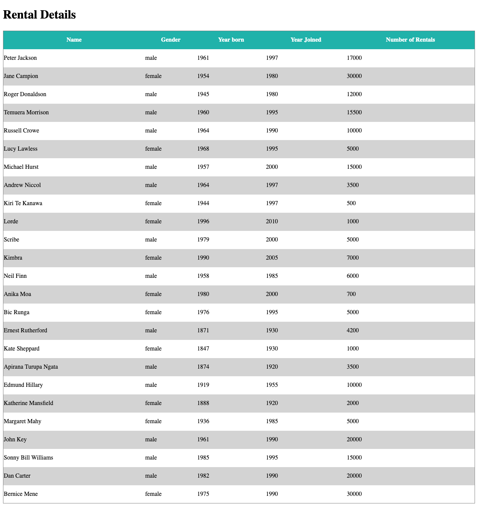

# Web Lab &ndash; JavaScript Objects &amp; JSON

In this lab, we continue our coverage of JavaScript by introducing JavaScript objects and JSON notation. This is a **vitally important** topic - understanding it well will be really important for the remainder of CS719!

## Obtaining the code

Now that you've obtained a copy of this repository through GitHub Classroom's invite, you have your own private version of this repository (i.e. the one you're looking at now)! To clone this repository onto your machine, click the green `Code` button, make sure `HTTPS` is selected, then click the `copy` button to the right of the web URL to copy its value. Then, clone onto your local machine from a terminal, using the `git clone` command.

If this is the first time you've ever cloned a repository on the current machine, you may be asked to enter your GitHub credentials. The "sign in with your browser" option should work just fine. You may need to enter your GitHub username and password, and / or authorize "git credential manager" to access your account. Perform these steps if asked.

Now, you should have a clone of your repository on your local machine, ready to develop!

Remember to commit and push your work regularly for backup purposes. It's also really good practice to create new branches for each exercise, and merge these into `main` using a Pull Request (PR) when they're complete (as opposed to simply pushing directly to `main` each time). This will get you used to a collaborative workflow style that will come in really handy when working on the final team project this semester!

## Exercise One &ndash; Revisiting the shopping list

In the previous lab, we looped through an array representing a shopping list, and displayed its items in a table. The array looked like this:

```js
const shoppingList = [
    "Puppies", 3,
    "Kittens", 8,
    "Pikachu", 2,
    "T-Rex", 4
];
```

Now that we know about JSON / JavaScript objects, we can define a much nicer *data structure* in which to store our shopping list items.

Begin by studying the contents of the [`ex01`](./exercises/ex01) folder, then perform the following steps to complete this exercise:

1. Define the `shoppingList` variable to hold an array of JSON, with the same contents as the shopping list shown above. Each element in the array should be a JSON object with two properties: `item` and `amount`.
2. At the marked location in `shopping-list.js`, iterate through the `shoppingList` array. For each item in the list, display it as a row in the `#table-body` `<tbody>`. The first column in the table should be the `item`s, the second column should be the `amount`s.

## Exercise Two – Map, Filter and Reduce

This exercise is designed to help you learn how to use the `.map`, `.filter` and `.reduce` methods in JavaScript. These methods are known as array **iterator methods** as they provide useful ways to perform common operations that relate to iterating over each element in an array.

Array iterator methods like `.map`, `.filter` and `.reduce` can be used on simple arrays or on arrays of objects, so they can be very useful for performing common operations on structured data.

You should make sure to use reference information online to further your understanding of these array iterator methods and to overview what other array iterator methods exist.

Here is a quick summary of what each of the three array iterator methods does:

- `.map` creates a new array populated with the results of calling a provided function on every element in the calling array; `.map` can be useful for a range of things like creating a new array that converts certain properties of the original array; for example, if you wanted to convert the price property of objects from one currency to another
- `.filter` creates a new array that is a copy of the original array filtered down to just the elements from the given array that pass the test implemented by the provided function; `.filter` can be useful for filtering arrays of information; for example, if you wanted to filter an array of objects to only contain objects which had a price property less than a certain amount
- `.reduce` executes a callback function on each element of the array which will reduce data in the array into a single value or object; `.reduce` can be useful for summarising information from an array; for example, if you want to calculate the total price of all objects in an array

The examples in this exercise also illustrate how each method works and demonstrate how the JavaScript arrow function ( `=>` ) can be used in place of the `function` keyword when creating anonymous functions. You should read extra reference information about the arrow function in order to understand the syntax and functionality of the arrow function.

You should spend some time examining the examples within this lab exercise as the steps of the task require you to implement very similar functionality to the examples.

This example also contains an array of book objects which is the array of data that will be accessed for each example and task; each book object in the array has six properties that relate to the title, author, genre, publication year, rating and pricing of a book. Make sure to examine the JavaScript code and book data so that you understand the code you are working with.

Note: the book data array has been included within the main JavaScript file as an example in this exercise; for a completed application, it would not be good practice to store a large amount of data within a JavaScript file like this. You would generally use a database or other form of organised data storage for large amounts of data like this.

##### Tasks:

1. Implement the functionality to display all books over a specific rating and display the data in the relevant part of the web page
   * You should use the `.filter` method in your solution for this task
   * You have been provided with all of the HTML code required and a lot of the JavaScript code required
   * You should only need to modify the contents of the relevant function as indicated by the `TODO` comment in the JavaScript file
   * Make sure to familiarise yourself with the code in this exercise and the example that uses the `.filter` method
2. Implement the functionality to calculate the average rating of all books and display the average in the relevant part of the web page
   * You should use the `.reduce` method in your solution for this task
   * You have been provided with all of the HTML code required and a lot of the JavaScript code required
   * You should only need to modify the contents of the relevant function as indicated by the `TODO` comment in the JavaScript file
   * Make sure to familiarise yourself with the code in this exercise and the example that uses the `.reduce` method
3. Implement the functionality to convert the rating of all books to a percentage and display the data in the relevant part of the web page; the current rating is out of 5, so it should be relatively easy to convert it to a percentage
   * You should use the `.map` method in your solution for this task
   * You have been provided with all of the HTML code required and a lot of the JavaScript code required
   * You should only need to modify the contents of the relevant function as indicated by the `TODO` comment in the JavaScript file
   * Make sure to familiarise yourself with the code in this exercise and the example that uses the `.map` method

When complete, the functionality for all 3 tasks should be able to be run by clicking the relevant buttons in the web page and viewing the results in the related part of the page. Make sure to test your code. The functionality for the tasks is very similar to the examples so you should be able to test the examples and your completed code by inputting the required data and clicking the related elements in the web page.

##### Suggested extension:

One optional suggested extension is to also add to the HTML & JavaScript portion of the page to implement some sort of sorting functionality through the use of the `.sort` method in JavaScript. You will need to research how to use the `.sort` method. As this is an optional extension, there are no fixed requirements; however, you should think about how a user of a site that lets users browser data relating to books would want to sort information they view.

## Exercise Three &ndash; A video rental site

In this exercise, we will build a customer database for a video rental site. The associated files can be found in the [`ex03`](./exercises/ex03) folder.

Inside `video_rental.html` you will find 2 tables, `#details` and `#statistics`. Using JavaScript, you will process the JSON data found in `customerdb.js` to populate these tables. Try to use good programming practices to split the problem into logical chunks and make use of functions. Do not make any changes to the HTML in the file, you must use JavaScript only to generate the output.

For this exercise, we'll complete just the `#details` table. In that table, create and insert a `<thead>` containing the titles:

```json
["Name", "Gender", "Year born", "Year Joined", "Number of Rentals"]
```

 **Hint:** Use the provided `headerNames` object for this purpose.

 In this same table, create a `<tbody>` that contains one row for each entry in the `customers` object. When complete, the output should look like that shown in the below screenshot.

 

## Exercise Four &ndash; An image gallery

In this exercise, we will complete the functionality of a page allowing the user to click on thumbnail images of various animals. Clicking on a thumbnail will cause a larger image and additional information to be displayed.

Begin by studying the contents of the [`ex04`](./exercises/ex04) folder. We will be editing **only `gallery.js`** for this exercise. No changes to other files are allowed, but it's still worth knowing about their contents.

We will complete several features of this application by adding to `gallery.js`. To complete this exercise, perform the following tasks:

1. Complete the `changeImage()` function. This function accepts a single gallery item as an argument, and should display it in the featured area on the page. `galleryItem` will be one of the elements of the `gallery` array (see `gallerydata.js`). It is a JavaScript object formatted as per the following example:

   ```js
   {
       fileName: "arctic_fox.jpg",
       thumbnailName: "arctic_fox.gif",
       tooltip: "An arctic fox",
       description: "The Arctic fox, also ....."
   }
   ```

   To display a gallery item in the featured area:

   - the `#descriptionText` paragraph's content should be set to the item's `description`.
   - The `#featuredImage` img's `title` and `alt` should be set to the gallery item's `tooltip`.
   - The `#featuredImage` img's `src` should be set to the gallery item's `fileName`, **prepended with `./assets/`** (i.e. the directory name).
2. Take a look at the `loadRandomImage()` function. This function picks a random index into the `gallery` array, then calls the `changeImage()` function you just completed, supplying the gallery item at that index as a parameter.

   We want to display a random image when the page loads. At the marked location (*TODO 2*), near the top of the file, add a call to `loadRandomImage()`. Once this is done, you should be able to view your page in a browser. Every time you refresh, a different image and description should be shown.
3. Now, we will add functionality such that whenever the featured image is clicked, a new random image will be displayed. At the marked location (*TODO 3*), add an event listener to the `#featuredImage`, so that whenever it is clicked, the `loadRandomImage` function will be called. Once complete, reload your page and test the new functionality.
4. Loading random gallery items is great, but we want the user to be able to choose specific gallery items to view. To do this, we will add thumbnails of each gallery item to the page. Clicking a thumbnail will cause that gallery item to be displayed.

   To add this functionality, complete the implementation of the `createThumbnails()` function (located near the bottom of the file). This function should loop through the `gallery` array. For each item in that array, it should:

   - Create a `<div>` with the `thumb-holder` CSS class.
   - Create an `` whose `src` is set to the current gallery item's `thumbnailName`, **prepended with `./assets/thumbs/`** (i.e. the thumbnail directory name).
   - Append the newly created `` to the newly created `<div>`.
   - Append the newly created `<div>` to the `#thumbview` div.
   - Add a click event listener to the newly created `<div>`. When it is clicked, the `changeImage()` function should be called, supplying the current gallery item as a parameter.
5. To complete the exercise, add a call to the `createThumbnails()` function at the marked location (*TODO 5*, right at the top of the file). Once you've completed this step, you should be able to see a list of thumbnails when the page is loaded. Clicking on a thumbnail will cause that gallery item to be displayed in the feature view. A random gallery item should still be displayed when the page loads and when the feature image is clicked (i.e. no pre-existing functionality should be broken).

# Challenges

These exercises are extension material for you to work on once you've completed all other lab exercises. If you don't get round to them during the lab, that's OK. In that case, it's a good idea to come back to them later on in the course, once you're more comfortable with the course content.

## Challenge Exercise Five &ndash; Extending the video rental site

In this exercise, we will continue on from Exercise Two, and complete the Summary Statistics section of the site.

Within `video_rentals.js`, you have been provided with the constant `summaryStatistics` that provides a data structure that you can use to help store the statistics that you calculate for the table. In this exercise, we'll create one or more functions which correctly populate this data structure, and then we'll create a table to display the data.

In the `#statistics` you will calculate and display some statistics about the customers found in the JSON. You will need to compute:

- the total number of male customers
- the total number of females customers
- the total number of people in the age ranges 0-30, 31-64, and 65+
- the tally of customers in various "loyalty status" tiers, where:
  - those who borrowed more than 4 videos a week during the period of their membership are in the "gold" category.
  - Those who borrowed between 1 and 4 videos per week are in the "silver" category
  - those with less than one video out per week are of the "bronze" category.

The age of each user can be calculated using the current year and the year each member was born. Similarly to calculate which loyalty tier each user belongs to, you will need to compute how long they have been a member of the store, and use their total number of rentals to establish an average `movies_per_week` value.

Once these statistics have been calculated, display them as shown in the below screenshot.


## Challenge Exercise Six &ndash; Extending the image gallery

Continuing on from Exercise Three, we would like the currently-displayed gallery item's thumbnail to be highighted `darkgreen`, as can be seen in the below screenshot:


There are several ways in which we can do this. You're welcome to try and come up with your own way, or follow these tips.

1. Modify your `createThumbnails()` function, so that in addition to adding your new `<div>` to the page, you also store a reference to it inside its corresponding gallery item. You can simply add a new property to the gallery item - it will work, even if such a property hasn't been defined before. For example:

   ```js
   const newDiv = document.createElment("div");

   // Your other code here...

   // Will work, even though the galleryItem didn't have a thumbnailDiv property until now.
   galleryItem.thumbnailDiv = newDiv;
   ```
2. Modify your `changeImage()` function, so that after setting the text and image, you also loop through the `gallery` array. For each gallery item in the array, set the background color of its associated thumbnail div to `null`, to remove any previous highlighting (you should be able to access this via the item's `thumbnailDiv` property if you are following along).
3. After the loop above, set the displayed `galleryItem`'s thumbnail div to have a `darkgreen` background color.

Once you've finished this exercise, the currently selected gallery item's thumbnail will be highlighted. This should be true whether you click on a thumbnail, or whether a random item is displayed (on page load or by clicking the feature image).
