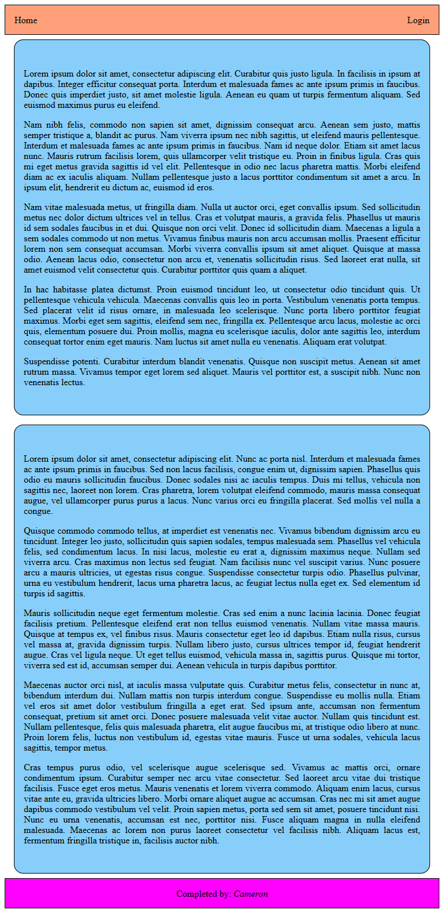
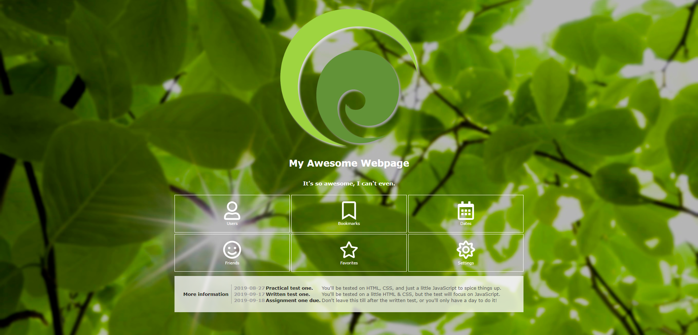
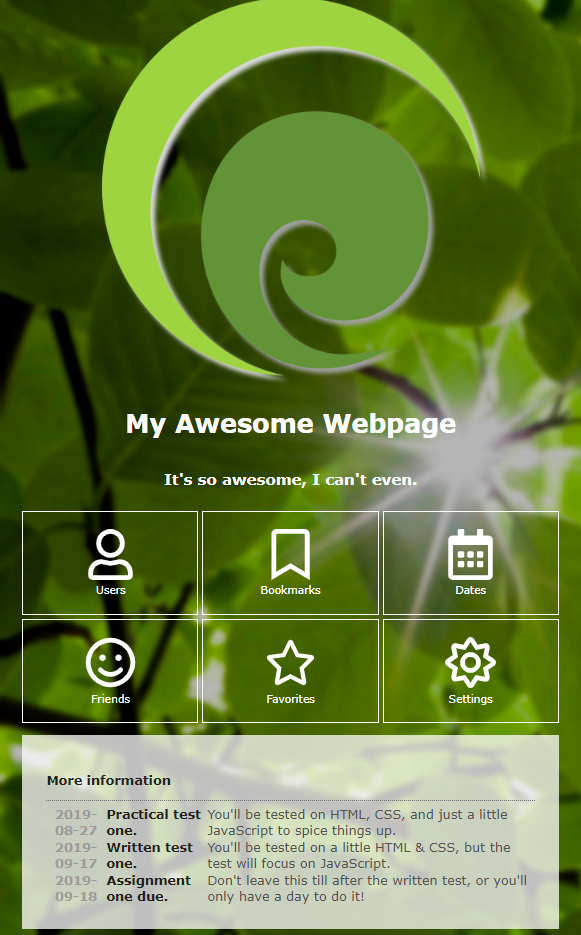
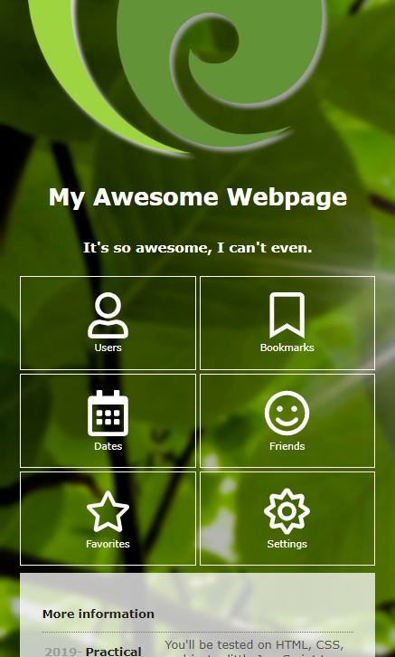

# Web Lab &ndash; CSS Grid, Flexbox, and Responsive Design
In this lab, we continue our coverage of CSS by covering techniques used to deliver modern, responseive page layouts.

## Obtaining the code
Now that you've obtained a copy of this repository through GitHub Classroom's invite, you have your own private version of this repository (i.e. the one you're looking at now)! To clone this repository onto your machine, click the green `Code` button, make sure `HTTPS` is selected, then click the `copy` button to the right of the web URL to copy its value. Then, clone onto your local machine from a terminal, using the `git clone` command.

If this is the first time you've ever cloned a repository on the current machine, you may be asked to enter your GitHub credentials. The "sign in with your browser" option should work just fine. You may need to enter your GitHub username and password, and / or authorize "git credential manager" to access your account. Perform these steps if asked.

Now, you should have a clone of your repository on your local machine, ready to develop!

Remember to commit and push your work regularly for backup purposes. It's also really good practice to create new branches for each exercise, and merge these into `main` using a Pull Request (PR) when they're complete (as opposed to simply pushing directly to `main` each time). This will get you used to a collaborative workflow style that will come in really handy when working on the final team project this semester!


## Exercise One &ndash; Two-column layout using CSS Grid and Flexbox
In this exercise, we'll create a simple two-column page **using CSS grid**. For this exercise, complete the HTML and CSS files located in the [`ex04`](./exercises/ex04) folder (they are currently blank - you'll need to complete them from scratch).

Using CSS Grid, recreate the following two-column layout webpage.
 

 
This page is made up of four major elements: the header, left column, right column, and footer. 

The header element should be positioned at the top of the page, and should occupy the full width of the viewport. Surround the header with a simple **1px** wide black border, and color it a shade of orange. Inside the element, add two text elements containing the words *Home* and *Login*. The *Home* element should be aligned to the left side of the header, and the *Login* to the right. These should be vertically-centered within the header, and should have a small amount of space between the text and the edge of the header. Do **not** use floats for this, investigate the CSS feature `flexbox`. 

The footer element should be the same height and width as the header, and again should have a simple black border, but the background color should be a shade of purple. Centered both vertically and horizontally, add a text element with the text `Created by: username`, where `username` should be your name. As with the header, do not use floats for this alignment.

The left and right columns should have the same width and height as each-other, and should be centered on the page to the left and right of the center line, with empty space between them and the edge of the viewport. Surround each of these elements with a simple black border that has a moderate radius on each corner. Each column should be colored a shade of blue. Fill these columns with some placeholder [Lorem Ipsum text](https://www.lipsum.com/), then style this so that the text is justified and has suitable space between the text and edge of the column.

**Hint:** You may use *named grid areas* to specify where each of the four major elements should be positioned on the webpage.


## Exercise Two &ndash; Making our layout responsive
Continuing on from Exercise Two, modify `two_col_styles.css` so that when the browser displaying the `two_col.html` webpage is resized so that its width is less than `1000px`, the layout converts to a stacked-column layout, with each column of text occupying the full width of the page. This should look something like the following picture.



**Hint:** This can be done with a single media query modifying only the **`grid-template-*`** properties of your CSS Grid container, if you used grid areas for Exercise Four.


## Exercise Three &ndash; Web design
In this exercise, we will add the necessary CSS to a webpage such that it looks as per the below screenshot. **You may not edit the HTML for this exercise - only the CSS**.



First, let's complete the base website design. Examine the contents of the [`ex03`](./exercises/ex03) folder, then make modifications to `site.css`.

You may choose to follow the specification below, or you may experiment yourself.

### Specification

- All elements on the page should have the Verdana font. If that font is not available, the Geneva font should be used. If neither are available, then sans-serif font should be used.

- By default, all elements on the page should have the text color `#FEFEFE`.

- The `body` should have a background image set to `./assets/bigleaves.jpg`. The background image should be set to `no-repeat`, and should be set to `cover` mode.

- The `body` should have padding of `20px` on the top, right, and left sides.

- The `.container` div should have a width of `1200px`. It should have `auto` margins on the left and right.

- All headings should have `bold` font.

- The `.header` div should lay out its child components using *flexbox*. It should align them in a column, and horizontally center its children.

- The `.buttongrid` div and its children should be styled as follows:

   - The `.buttongrid` div should have top and bottom margins of `10px`. It should lay out its child components using *CSS grid*, with three columns of equal width. Grid row height should be `auto`. The *gap* between rows and columns should be `5px`.

   - The `button`s inside the button grid should have a `transparent` background color, and a `1px` solid white border. They should have a padding of `20px` on the top and bottom, and `5px` on the left and right.

   - When the user hovers over those buttons, the background color should change to `rgba(255, 255, 255, 0.5)`. The transition should happen smoothly over 0.25 seconds.

   - The buttons should lay out their child components using *flexbox*. Child components should be laid out in a `column`, and should be centered vertically and horizontally.

   - All ``s inside the button grid should be `64px` square.

   - All children of the buttons inside the button grid should have `2px` margins on the top and bottom.

- The `.panel` div and its children should be styled as follows:

   - The `.panel` div should have a background color of `rgba(255, 255, 255, 0.75)`, and padding of `30px` on all sides. It should lay out its children using *flexbox*. Children should be laid out in a `row`, and be `stretch`ed vertically.

   - All *descendents* of the panel should have their text color set to `#231F20`.

   - The `.panellabel` div should have a `1px` dotted border on the right, with a color of `#706F6F`. It should also have a `5px` right margin, and `10px` right padding. It should center its child `<p>` vertically and horizontally.

   - The `.infotable`'s `<th>`s should have a text color of `rgb(155, 155, 155)`.

   - The `.infotable`'s `<td>`s should have a text color of `rgb(83, 83, 83)`.

**Hint 1:** To apply a style to *all items* on a page, you can use the following CSS selector:
```css
* {
    /* Your styles go here. */
}
```

**Hint 2:** To apply a style to *all children* of some elements, you can use `*` in conjunction with another selector. For example, the following CSS will apply a style to all children of a button:
```css
button > * {
    /* Your styles go here. */
}
```

### Responsive design
Now, we will make the website responsive using media queries.

On screens smaller than `1200px`, the `.container`'s `width` should be changed to `100%`.

On screens smaller than `800px`, the page should look similar to this screenshot:



Specifically, the following changes should be made:

- The `.panel` div should change its flex direction to `column`. It should justify its chidlren to the start, and stretch its children horizontally.

- The `.panellabel` should remove its right border, margin, and padding. Those should be replaced with a `5px` bottom margin, and a `1px` dotted `#706F6F` bottom border.

On screens smaller than `600px`, the page should look similar to this screenshot:



Specifically, the `.buttongrid` div should now only contain two columns, rather than three.
