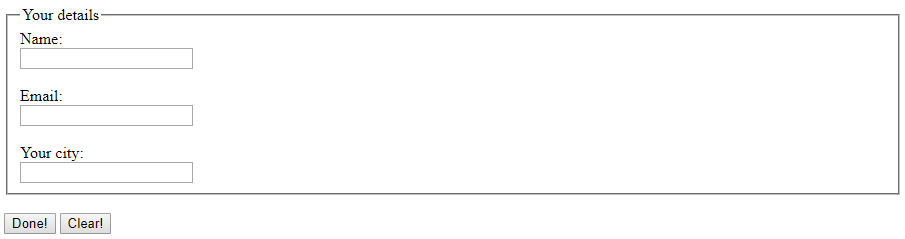

# Web Lab &ndash; HTML Forms
In this lab, we conclude our HTML coverage by looking at HTML forms. These allow you to submit data to a server for processing.


## Exercise One &ndash; Constructing and submitting a form
Open [`form.html`](./exercises/ex01/form.html), located in the [`ex01`](./exercises/ex01) folder. Create a `<form>` in that HTML file, like the one in this screenshot:



Ensure you give sensible names and values to all of the inputs. Then, add the submit button (labelled *"Done!"* in the screenshot) and the reset button, labelled *"Clear"*.

Finally, modify your HTML so that when the *"Submit"* button is pressed, the data is submitted to the application located at the <https://echo.trex-sandwich.com> address.

Preview your form and try submitting it.
- What is shown to you after submitting the page?
- What happens if you change the method of of your form?

Type your answers to the above questions in the space below.

```
It provides a page with key-value pairs noted. 
It changes the method of data submission from url to the html page data. 
```


## Exercise Two &ndash; More form controls
Continuing on from Exercise One, add further form controls and other elements to your HTML page so that the completed form looks like the one in this screenshot:


Again, make sure to give sensible names and values to the inputs. Make sure you test your modified form by submitting to the same URL as in Exercise Thirteen.
