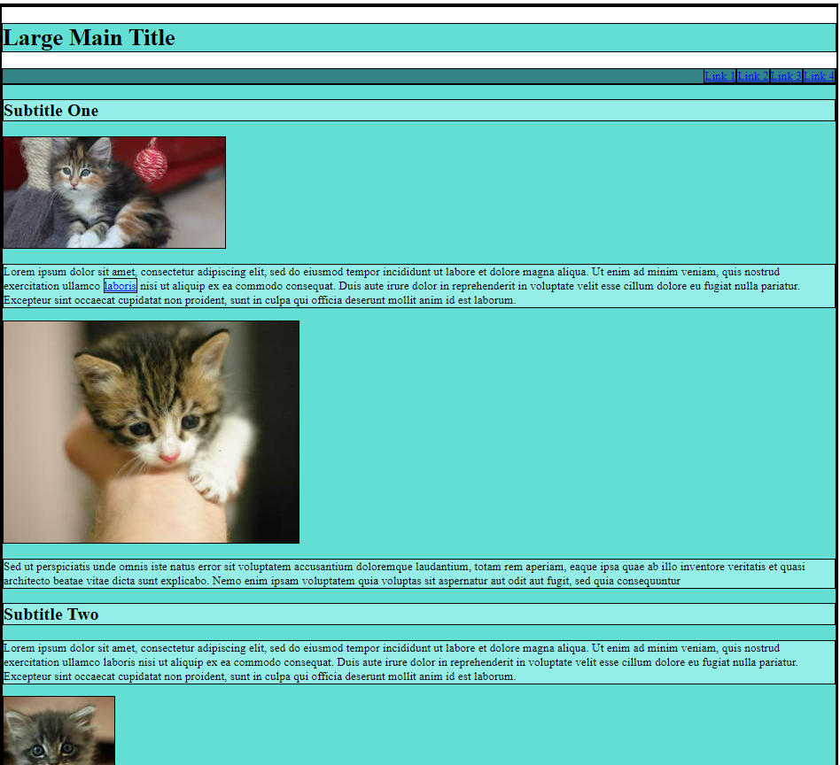
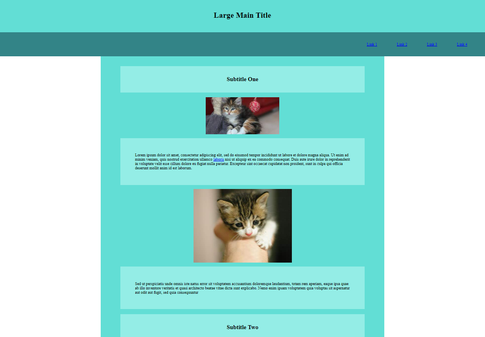

# Web Lab &ndash; CSS Positioning

In this lab, we continue our CSS coverage - this time, looking at CSS positioning and other methods of moving elements on a page.

## Obtaining the code

Now that you've obtained a copy of this repository through GitHub Classroom's invite, you have your own private version of this repository (i.e. the one you're looking at now)! To clone this repository onto your machine, click the green `Code` button, make sure `HTTPS` is selected, then click the `copy` button to the right of the web URL to copy its value. Then, clone onto your local machine from a terminal, using the `git clone` command.

If this is the first time you've ever cloned a repository on the current machine, you may be asked to enter your GitHub credentials. The "sign in with your browser" option should work just fine. You may need to enter your GitHub username and password, and / or authorize "git credential manager" to access your account. Perform these steps if asked.

Now, you should have a clone of your repository on your local machine, ready to develop!

Remember to commit and push your work regularly for backup purposes. 

## Exercise One - Basic Layout With Box Model

This exercise is designed to give you an opportunity to practise laying out content using padding, margin and other CSS properties. 

You have been provided some place holder content and basic CSS code; when the page initially loads it should look something like this:



Notice that before the appropriate CSS properties are added that all text and images are against the left side of the screen and paragraphs stretch across the full width of the screen.

### Task:

Your goal will be to use a range of CSS properties to change the way that elements are laid out so that it looks something like this: 



You should examine the contents of the HTML and CSS file provided to you and familiarise yourself with the code. 

There are some `div` elements within the HTML page with `id` or `class` attributes that have associated CSS selectors that can be used to apply CSS properties to major blocks of the page like the `nav` and main `container` . Make sure you look carefully at the structure of the HTML and the default CSS selectors provided to you as you will be making use of these to complete the task.

You should also think carefully about what CSS selectors you can use; you may create new CSS selectors if required.

You do not have to make your page look exactly like the image above; you should experiment and view the page in your web browser to make sure that the spacing of elements is suitable to view in your browser. 

The most important thing is that the finished page looks something like the image above; feel free to experiment with various CSS properties and observe the results; the following general requirements and hints can be used as a guide if you are stuck:

- All headings (`h1`& `h2` elements) should be centered and the text within them should be center aligned

- There should be suitable padding within `h1` and `h2` elements so that the text is not running to the edge of the element

- The `h2` elements should be centered within their surrounding div and the text inside the `h2` elements should be centred

- Text in paragraph elements should be left aligned, but there should be padding within the paragraph element to stop the text from running to the edge of the element

- The `h1` and `nav` div elements should extend across the full width of the screen

- There should be no white space in between these elements
  
  - You will likely find that by default there is white space above and below the `h1` element due to some default properties of elements; you will be able to override default properties with CSS code you write in the CSS file

- The `container` div element that contains the `h2` , `paragraph` and `image` elements should be narrower than the screen and have blank white margin space on the left and right as can be seen in the image above; the blank margins either side of the `container` div should take up about 20% of the screen each with the `container` div being centred in the middle
  
  - **Hint**: if you are having difficulty centering the `container` div, investigate the `margin: auto;` property and look up information about how to use it

- The image elements should be centred 
  
  - **Hint**: there are various methods for centering image elements; image elements are inline elements by default which means they are laid out in much the same way as text characters would be within their parent element; one option for centering images is using the `display: block;` property in CSS to force image elements to be block level elements and then use the `margin: auto;` property to centre them within their parent element

- The anchor elements/links within the `nav` div should be right-aligned with space in between each link as can be seen in the image above

- Padding, margin and other properties should be used where appropriate to make all elements position themselves similar to the image above; make sure to pay attention to how the `h2` and `paragraph` elements position themselves within the parent element (the `container` div); there should be space between the edge of the  `h2` and `paragraph` elements and the edge of the `container` div

- **Note**: remember that sometimes modifying the margin of a child element will achieve a similar result to modifying the padding of its parent element; there are some advantages to either approach depending on the context so make sure to consider carefully what option is best in any given context

- When finished, you can remove the `1px solid black` border property that is added to all elements by deleting or commenting out the appropriate lines of CSS

When finished, try resizing your browser window and/or zooming in and out in order to check that elements still display appropriately on varying screen sizes. If you have mainly used padding and margin properties, you should find that most page content displays fairly well as the window or zoom level changes. There are some properties that can cause issues when pages resize; for example, adding fixed widths to any elements can cause them to overflow outside of containing elements. 

## Exercise Two - A CSSmas tree

In this exercise, you’re going to decorate an image of a Christmas tree with baubles, and place it all over a nice New Zealand landscape photograph. You will find the images used in this exercise in the [`ex02/assets`](./exercises/ex01/assets) folder. Any HTML for this question should be placed in [`christmas_tree.html`](./exercises/ex01/christmas_tree.html), and any associated CSS should be written in [`christmas_tree_style.css`](./exercises/ex01/christmas_tree_style.css) (these files are found in the [`ex02`](./exercises/ex01) folder). An example of what your page may look like when complete is shown below.


Begin by creating eight `` elements in the document, displaying each of the 8 images in the assets directory. Give each image a meaningful `id`, and additionally give each of the colored bauble images a common class. Position the image that should sit at the back so that it sits in the middle of the web browser viewport. Using CSS, move the *'pohutukawa'* tree image so that it sits on top of the background image, in such a way that makes it look like it is a part of the background.

Style the colored baubles so that they appear to be decoratively scattered over the tree. Update at least one of the baubles so that it appears *behind* the pohutukawa tree (see the pink bauble in the above screenshot for an example).

### HINTS:

- You may find it useful to use a container `<div>` with relative or absolute positioning, so that any elements/images within it can position themselves absolutely with respect to the parent element.
  - Remember to check the reference information carefully for the different CSS positioning properties; if you want to use position absolute in relation to a parent element, the parent element will need to have a position property applied to it as well otherwise child elements will be positioned in relation to the viewport of the whole page.
- Use absolute positioning on the background to cover the entire div starting at the top left. The image shouldn't have to resize if you make the container div the same size as the background image; you can find out the width and height of images by looking at the file details in your file browser or IDE.
- To make items appear on top of one-another, you will want to look into the `z-index` of the elements.
- As you are completing the exercise, make sure to occasionally resize the window and/or zoom in/out; it is important to check that you are positioning the baubles appropriately in relation to the images that should appear behind them and that they remain positioned correctly if the window resizes or the zoom level changes. 


## Exercise Three - Expanding baubles

Continuing on from Exercise One, add the necessary CSS to get any bauble hanging on the Christmas tree to become bigger when the user hovers over it.

**Hint:** Remember the `:hover` CSS pseudoclass.

**Note:** Because one of the baubles has been styled so that it was behind the tree, you may notice that such a bauble doesn't respond to hover events. This is because the tree image, being in front of it, captures the hover event first. To change this default behaviour it is possible in CSS to set elements to ignore events from the mouse, stylus or touch &ndash; generically classified as *pointer events*. To get your tree image to ignore pointer events so that these events are passed on to elements behind the tree instead, add something like this:

```css
#tree {
    pointer-events: none; /* to restore it, set value to: auto */
}
```

Try using this to get hover events to work on any obscured baubles you have. For more information refer to <https://css-tricks.com/almanac/properties/p/pointer-events/>.

## Challenge Exercise Four - Reverse engineering from a screenshot

This exercise is extension material for you to work on once you've completed all other lab exercises. If you don't get round to it during the lab, that's OK - this question is more difficult than what you would expect to see in a test. In that case, it's a good idea to come back to it later on in the course, once you're more comfortable with the course content - but these exercises are still really valuable to complete.

**Note:** Support from tutors / instructors on these questions is extremely limited, as their focus will be on assisting students with the preceding exercises.

Take a look at the webpage located in the [`ex04`](./exercises/ex04) folder. Here, you'll see a website whose stylesheet (`style.css`) has had a number of `margin`, `padding`, `position`, `float`, and `width` properties removed from its elements. Modify `style.css` so that the webpage looks similar to the screenshot shown in [`exercise-11-fullpage.png`](./spec/exercise-04-fullpage.png).

**Note:** 23 properties were removed from the CSS. You can use this number as a guide, but need not seek to add exactly that many properties back however, as it is possible to find alternate solutions that lead to the same layout.
