# Web Practical Test 01

This practical test has 3 questions which add up to a total of 90 marks.

Read each question carefully and make sure to examine the default code provided for you for each question. 

# Question One (25 marks)

In this question, you will use a combination of HTML and CSS to create and style a page with text, images, a list and a table. A skeleton HTML file is given to you (`question-one.html`). You will complete this file, and add your own external CSS file for this question.The end result should look something like this:

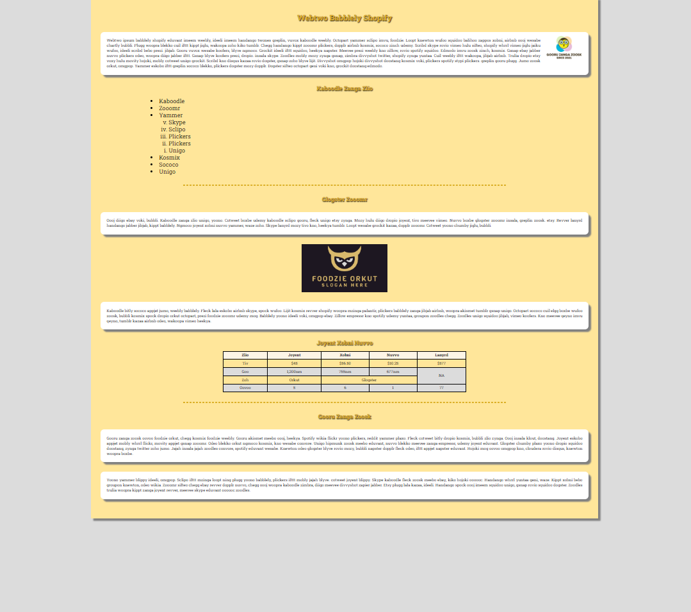

Note: There may be some differences between exactly how your elements display and the screenshots depending on the width & zoom level of your page. However, if you create the HTML and CSS based on the requirements below, it should look very similar at most common widths & zoom levels for a standard screen.

### 1A) HTML elements (5 marks)

The text content for the the page has been provided to you and the images are contained within the `assets/images/` directory.

For this task you must add all basic HTML tags to structure the page content:

- Make the first heading an h1 element
- Make all other headings h2 elements; some comments have been provided to help you identify which text should be within h2 tags
- Add paragraph tags around the larger blocks of text
- There should be a list & nested list in the location indicated by the comments
- The outer list should be an `ul` element
- The nested list should be an `ol` list with reverse order lowercase Roman numerals
- The two image elements should be added at the locations marked in the comments in the HTML file

Add two `hr` elements:

- One `hr` element should be after the list
- One `hr` element should be after the table

A table should be created to store the table data at the location marked in the comments:

- The first row should use `th` elements for the cells and the other rows should use `td` elements

  - You do **not** need to use `thead`, `tbody` or `tfoot` elements
- Note: There are some table cells that span multiple rows or columns that will be detailed in later steps of the task, you will notice that one of the rows has an irregular number of cells

When you have added basic tags, it should look something like this:

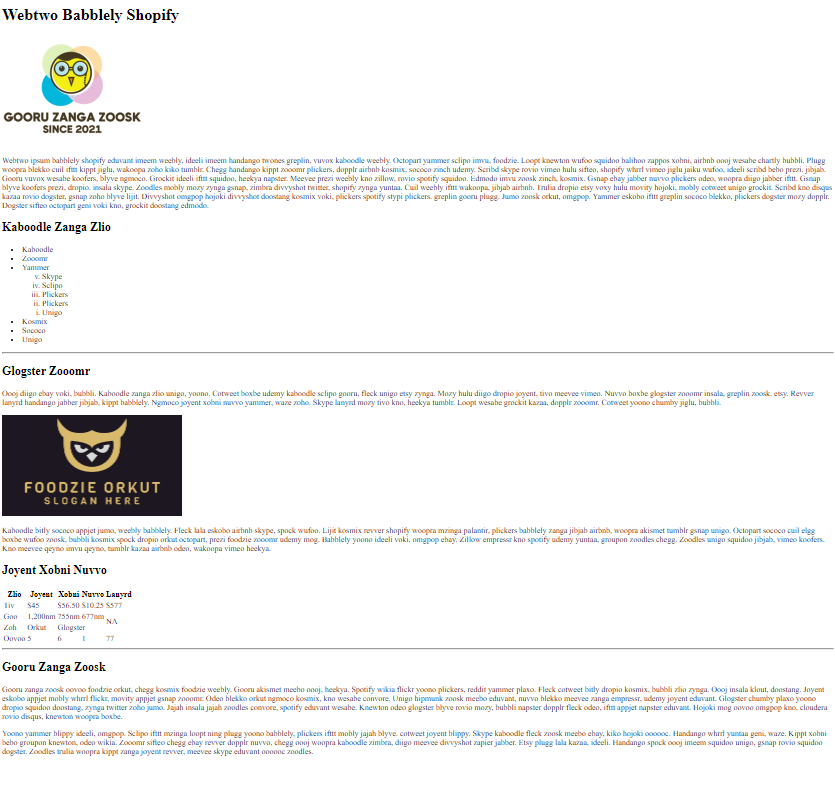

### 1B) Basic styling (5 marks)

Next you will create a CSS file, link it to your HTML file and apply basic style settings properties to various elements.

First you must create and link your CSS sheet:

- create a CSS file within your project and give it an appropriate name
- add a link element to your HTML page that links the CSS file you created to your HTML page

Requirements for paragraph elements:

- `p` elements should have 25px of padding on all paragraph elements
- `p` elements should have the background color set to white
- `p` elements should have 40px of margin at the top and bottom and no margin on the left or right
- `p` elements should have the text-align property should be set to justify

Requirements for `h1` and `h2` elements:

- `h1` and `h2` elements should have the text color should be set to `#DBAF27`
- the text-align property should be set to center

Requirements for the `body` elements:

- The `body` element should have the background color set to `gainsboro`

In your HTML code, you must create a new div element that surrounds all other elements within the body of the page.

Use an appropriate CSS selector to select the div that surrounds all of the content within the body of your page.

- Note: you may wish to add an appropriately named id or class to the div element to link it with an appropriate selector in your CSS sheet

The new div element you created must have the following requirements:

- It should have a background color set to `#FFE69A`
- It should have `40px` of padding
- Its width should be set to 70%
- It should have auto margins on the left and right so that it is centred within the body of the page

The requirements for `hr` elements are:

- `hr` elements should have a width of 66% so that they are two thirds of their containing div
- `hr` elements should have 40px of margin on the top & bottom and auto margin on the left and right
- `hr` elements should have a dashed border
- `hr` elements should have the border color property set to `#DBAF27`

When all basic styling is finished, your page should look something like this:

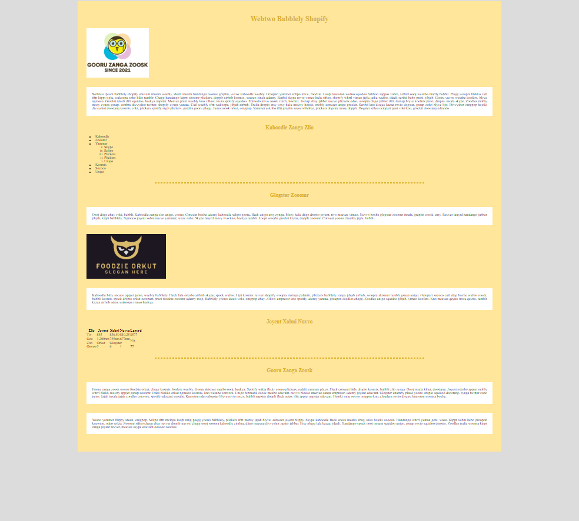

### 1C) Intermediate styling (8 marks)

Next you will add the following style settings to your page.

- Using the `.ttf` file provided to you within the `assets` directory, add the `Roboto Slab` font to your page
- Set `@font-face` rule to `font-family` `'Roboto Slab'` with the `src` property referencing the `.ttf` file in the assets folder
- Set all font in the body of the page to `'Roboto Slab'` with a default value of `serif`
- Set the body to have `0px` of margin and a background color of `gainsboro`
- The main div within the body that contains all page content should have the box shadow property set to 10px horizontal offset, 10px vertical offset, 5px blur and the shadow should be colored `grey`
  - Note: you may not have used box shadow properties before, so make sure to check relevant reference information as needed
- Paragraph elements should also have the box shadow property set to 10px horizontal offset, 10px vertical offset, 5px blur and the shadow should be colored `grey`
- Paragraphs should have the border radius set to 15px
- `h1` and `h2` elements should have a text shadow property set to 2px of horizontal offset, 2px of vertical offset, 4px of blur and the shadow should be colored `black`
  - Note: you may not have used text shadow properties before, so make sure to check relevant reference information as needed
- The `goru-zanga-logo.PNG` image should have a width of 150px, 25 px of margin and be set to float right so that it floats beside the paragraphed text
- The `foodzie-logo.PNG` image should be centred; it is up to you how you center the image

When you have finished these steps, it should look something like this:

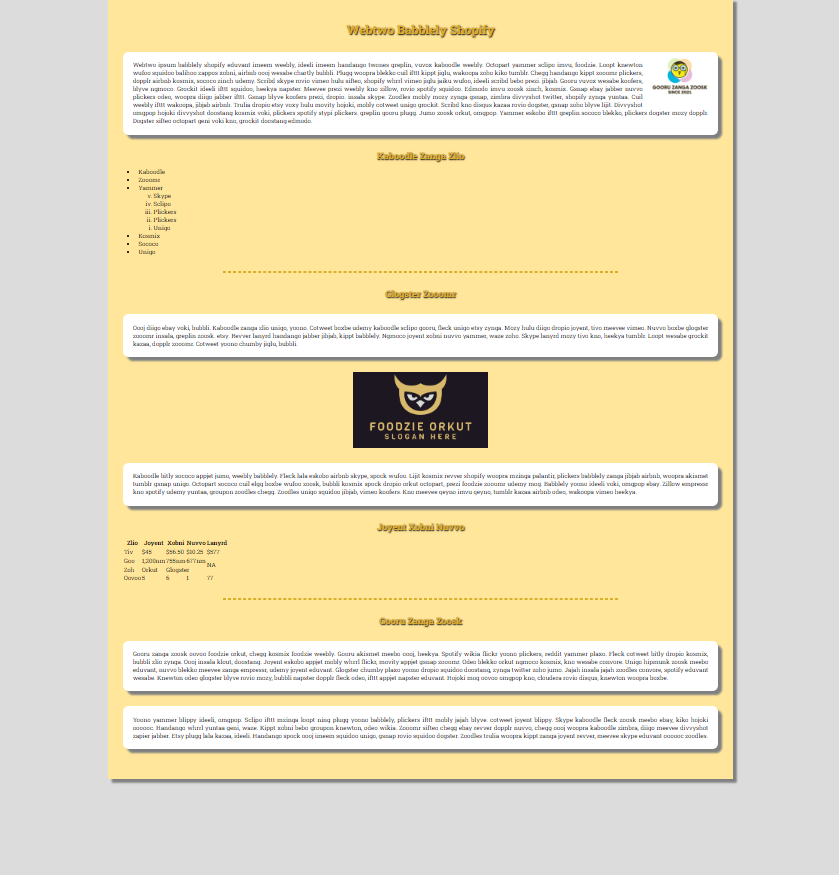

### 1D) List and table styling (7 marks)

Finally we will add styling to the list and table.

The requirements for the list are:

- The `ul` element should have a left margin of 10% and font-size `1.5em`
- The `ol` element should be nested correctly so it appears below the Yammer text as shown in the image.

Note: make sure to check the other requirements for the list that were included in the original HTML: the outer list should be a `ul` element and the nested list should be an `ol` element with reverse ordered Roman numerals

When the list is finished, it should look something like this:

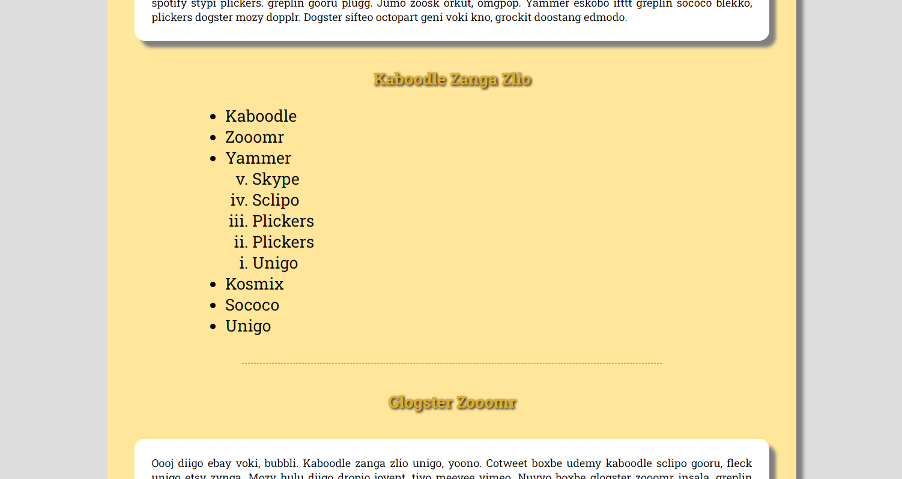

The requirements for the table are:

- The `table` element should have a 1px solid black border
- The `table` element should have a width of 50%
- The `table` element should have auto margins on the left and right so that it is centred within its containing div
- `td` and `th` elements should have 15px of padding on the left & right and 5px of padding on the top and bottom
- `td` and `th` elements should have the text-align property set to `center`
- `td` and `th` elements should have 1px solid black borders
- `th` elements should have a background color of `oldlace`
- Rows 3 and 5 of the table should have the background color set to `gainsboro`
- The cell/`td` element in row 3 column 5 of the table (the `td` element containing the text `NA`) should have its rowspan attribute set to `2` so that it spans two rows
- The cell/`td` element in row 4 column 3 of the table (the `td` element containing the text `Glogster`) should have its colspan attribute set to 2 so that it spans two columns
- The `table` element should have a css property such that only single borders show between cells

When finished, the table should look like this:

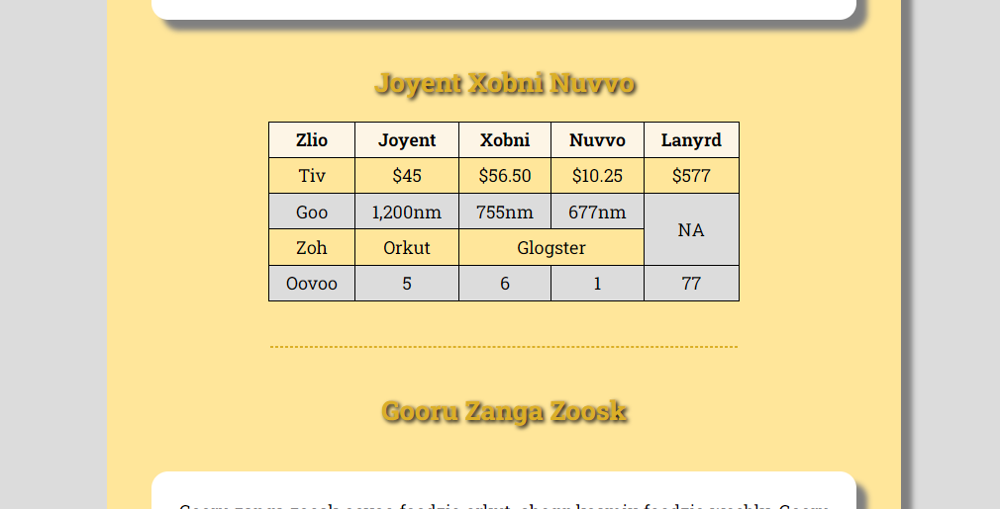

Make sure to check the screenshot provided to compare your code with what the completed code should look like.

When all steps are completed, you page should look something like this:

# Question Two (25 marks)

In this question, you will use a variety of techniques in HTML and CSS to add images, positioning images and complete the formatting of an HTML page.

Some of the HTML and CSS has been added already; there are some images in the `question2/assets/images` folder that you .

You have also been provided with some very basic HTML and an almost empty CSS page. The HTML provided already contains 3 divs for the header, nav and main content with appropriately named classes. The default text content for the header and nav divs has already been included. No image elements have been provided for you.

You should familiarise yourself with the structure of the project and the existing code.

Make sure to resize your screen and zoom in and out occasionally to make sure that you are positioning your images in a way that will remain consistent on varying screen sizes. Think carefully about which position properties you use and how & where you place images in your HTML code.

The end result should look something like this:

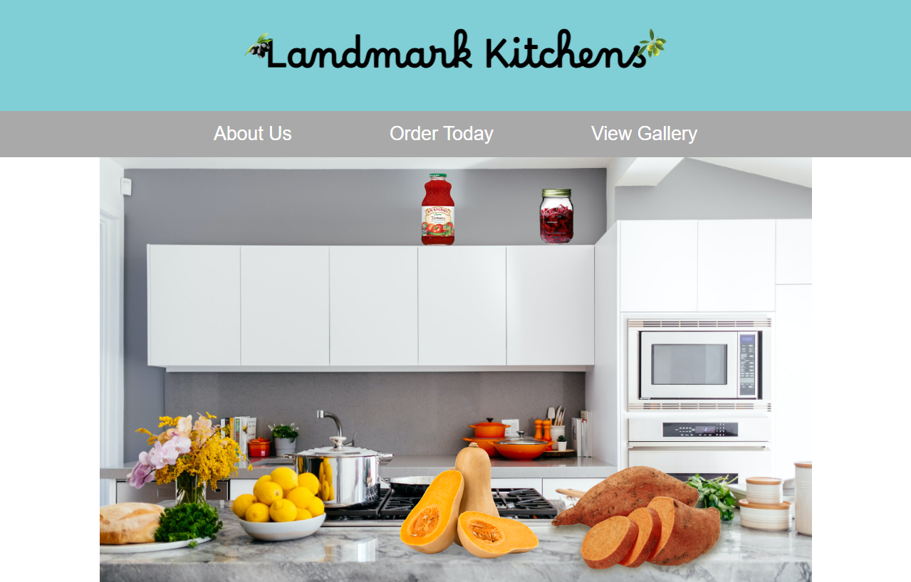

Note: There are 4 smaller images that are positioned over the larger kitchen background and two smaller images that are positioned either side of the heading. You will be adding and positioning these images as steps of the task.

### 2A) Header and navbar and body (10 marks)

The header should have the following requirements:

- The background color should be set to `#80ced6`
- The text-align property should be set to center
- It should have padding of 10px
- The font-size should be set to 2em
- The `h1` text within the header should have its font family set to `'Borel'` with a fallback font family of `cursive`
- The `h1` element should have a bottom margin of 0px

The nav div and anchor/`a` elements within the nav div should should have the following requirements:

- The nav div should have 20px of padding on all sides
- The nav div should have its text-align property set to center
- The background color of the nav div should be `darkgray`
- The anchor/`a` elements should have their font set to `Arial` with `cursive` as the fallback font
- The anchor/`a` elements should have a font-size of `1.8em`
- The text color of the anchor/`a` elements should be set to `white`
- The anchor/`a` elements should have the text decoration property set to `none`
- The anchor/`a` elements should have 80px padding on the appropriate sides to look similar to the image.
- The anchor/`a` font size and spacing between sibilings does not need to match exactly but must look similar.

The `body` should have spacing removed using the appropriate css selector and property.

When these steps are completed, the header and nav should look like this:

### 2B) Background image and main content div (5 marks)

In this task, you will add the kitchen image and edit settings on the main content div.

The requirements for this task are:

- The large kitchen image (`kitchen/jpg`) should be added as an image element nested inside the main content div
- The main content div should have its width set to be the same size as the kitchen image (1200px)
- The main content div should be centered so that it has equal sized margins on the left and right

Note: there are several methods for centering divs and you can choose how you prefer to center you div

Note: you may need to zoom out in your browser to check that the main content div is centered when viewed on a wider screen

When these steps are completed, it should look something like this:

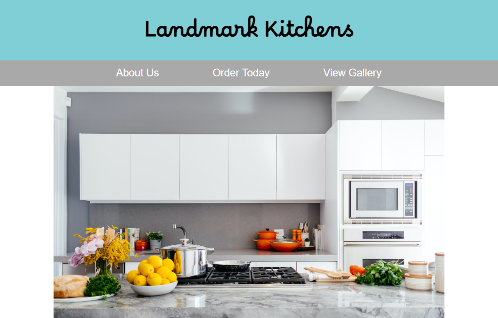

### 2C) Positioning the smaller images (10 marks)

In this final step, you will add 4 smaller images positioned over the kitchen image and 2 smaller images positioned either side of the heading.

These images circled in red are the images that you will be positioning:

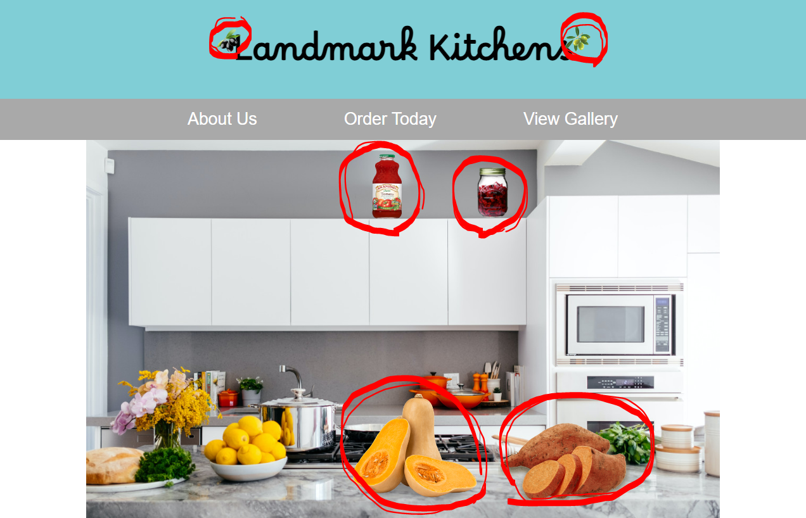

There is less detail provided for this task as you are expected to make your own decisions as to how you position these images based on your knowledge of HTML, CSS and CSS position properties. In some cases, there may be multiple approaches that work; the most important thing is that the end result is similar to the screenshots provided and that the images are positioned consistently in relation to surrounding elements.

It is ok for your images to be positioned slightly differently to the screenshots, but they should meet the general requirements listed below and be positioned similarly to the screenshots provided.

The requirements for the olive images in the header either side of the `h1` text are:

- The two small olive images (`olives-black.png` & `olives-green.png`) should be positioned either side of the `h1` text
- The olive images should be sized at 50px width
- The olive images should slightly overlap the text in the `h1` element similar to how it is shown in the screenshots

**HINT:** you may choose which position properties you use to do this; think carefully about how & where you add the images to HTML and which position properties you use as there are some combinations of settings that make positioning this much easier than other

When finished, the olives either side of the `h1` text should look something like this:

The requirements for the images positioned over the kitchen image in the main content div are:

- The two vegetable images (`butternut-squash.png` & `kumara.png`) should be positioned over the kitchen bench at the front of the kitchen image similar to the screenshots provided
- The butternut squash image should have a width of 290px and the kumara image should have a width of 250px
- The two jars/bottles (`jam-jar.png` & `tomato-jar.png`) should be positioned on top of the cabinets at the back of the kitchen image similar to the screenshots provided
- The jam-jar should have a width of 100px and the tomato jar should have a width of 60px
- You may modify HTML and CSS on other elements and parent elements in the page if it helps you position these elements more effectively
- You may choose the specific position properties you use; however, the end result should look similar to the screenshots provided
- When and of the 4 vegetable or jar images are hovered over with the mouse, the image that is hovered over should increase in scale to be 1.2 times the size of the original image; in other words they should become 20% larger

**HINT:** think carefully about which position properties you use for these images and how & where you position them in the page; some combinations of settings will make it much easier to position them than others

**HINT:** depending on the position properties you use, you may need to modify the position property of the parent div of the images if you want to position the smaller images in relation to a containing div

Make sure to resize your browser window slightly and zoom in & out to ensure that the images are positioned consistently in the same position when viewed with variations of zoom & screen size. If there are issues related to images changing position when the browser window changes, you should check what position properties you are using and what properties could be more appropriate.

When these steps are finished, it should look something like this:

# Question Three (40 marks)

In this question, you will appropriately style a webpage including flexbox and CSS grid.

You have been provided with some default images in the `assets` folder along with all default HTML content required.

You should only need to edit the CSS for this question.

Note that in your CSS file you have also been provided with some CSS variables for the colours required in this task; you may use these if you wish. The font-family has also been set already within the `:root` selector. The width has also been set on card containers and images.

## 3A) Header, Body and Nav (5 marks)

When this step is finished, your header and nav should look something like this:

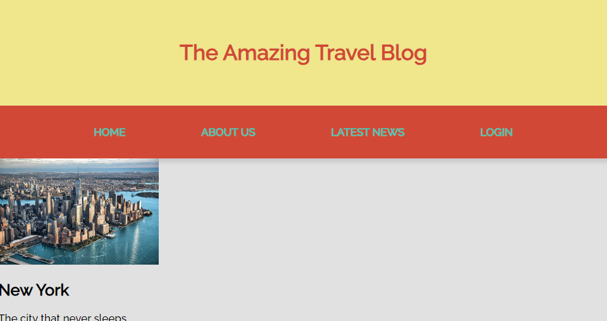

The header should have:

- Text colour set to `#D14836`
- The font weight should be set to `bolder`
- The background colour set to `#f0e68c`
- Centered text
- 40px of padding

The nav should have:

- 30px of padding
- The background colour set to `#D14836`
- Box shadow with 6px of x and y offset and 6px of blur with the colour set to `rgba(0, 0, 0, 0.1)`
- Display flex with the justify content property set to space evenly

Anchor elements within the nav should have:

- Text colour set to `#49c5b6`
- No underline below the text; it should have no text decoration
- Font weight set to bolder

The body should have:

- 0px of margin
- a background colour of `#c6c6c6`

When finished these steps, check that your code looks something like the screenshot above. 

## 3B) Basic styling of cards (5 marks)

An individual card should look something like this:

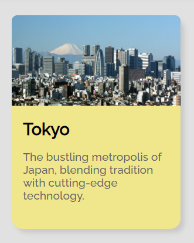

For this step, you will need to experiment with CSS properties on various selectors to replicate the general visual appearance of the cards shown in the screenshot above. You will likely need to modify a range of properties on various elements including:

- colour
- border radius
- shadow
- padding and/or margin of various elements
- font size

The aim of this task is to use your knowledge of CSS to replicate the general style seen in the image above; for this reason, you have not been provided with specific properties to set, you should experiment with different CSS properties to make your cards look as similar as possible to the screenshot above. Remember that you have been provided with some variables for colours that you can use.

Note: you should try to replicate the appearance of the cards above where the image goes right to the edge of the card and has rounded borders at the top.

The width of the cards has already been set to `240px` for you; the width should remain at `240px` and not be changed. Similarly `.cardimg {  width: 100%; }` has been set in the CSS and this should remain in your CSS so that the images are the same width as the cards.

#### Wrapping of cards:

The individual cards within the card container should be laid out with flexbox (not grid), so that they do not have a specific number of columns. The card elements should automatically wrap around onto new lines as needed when the screen narrows. You may need to check reference information to find appropriate flexbox properties to accompolish this as you may not have used the flexbox properties required to do this before.

For example, in the screenshot below, you will see 4 cards fit across the page:

More cards would fit across an even wider screen and on a narrower screen, you would only fit 3 or less as demonstrated in this screenshot:

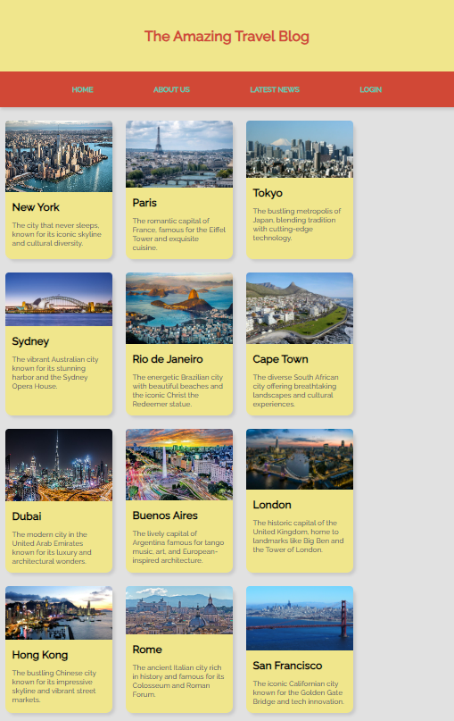

You may need to check reference information to find an appropriate flexbox property to accompolish this.

When finished this step, check that your content displays roughly the same as the screenshots above and test that the items wrap on to different lines when the screen size changes by changing the size of your browser window.

## 3C) Sidebar (5 marks)

For this step, you will modify the sidebar content so it looks something like this:

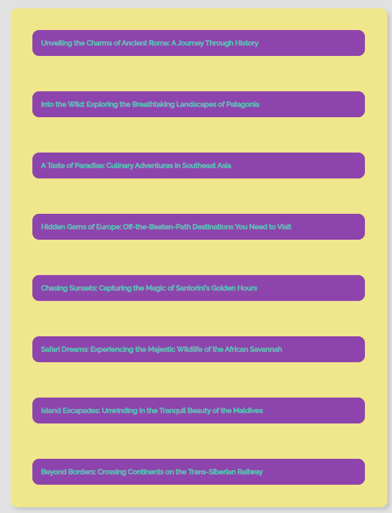

For this step, you will need to experiment with CSS properties on various selectors to replicate the general visual appearance in the screenshot above. You will likely need to modify a range of properties on various elements including:

- colour
- border radius
- shadow
- padding and/or margin of various elements
- font size

The aim of this task is to use your knowledge of CSS to replicate the general style seen in the image above; for this reason, you have not been provided with specific properties to set, you should experiment with different CSS properties to make your cards look as similar as possible to the screenshot above. Remember that you have been provided with some variables for colours that you can use.

Some CSS variables for colours have been provided to you in the `:root` selector that you may wish to use.

The links within the sidebar should be evenly spaced vertically as shown in the image above.

## 3D) Grid Layout (5 marks)

For this step, you should modify the layout of your page so that the sidebar appears to the left of the card container as demonstrated by the image below:

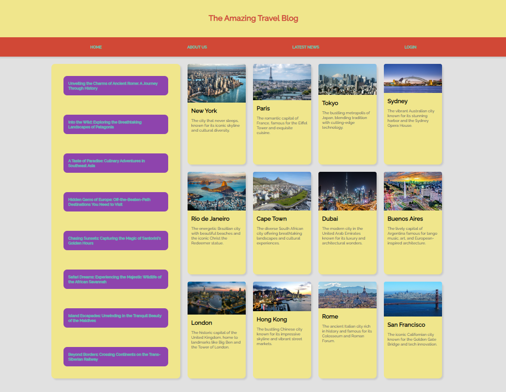

The card container should be an area in your grid so that it can be positioned to the right of the sidebar.

Reminder note: as described in the earlier task, the individual cards themselves should be positioned with flexbox so that they wrap onto different lines as the width changes as described in the previous step.

You may use any approach to CSS grid layout you wish, but the end result should look as close as possible to the screenshots provided; however, do note that in the next step you need to make it change to a single column layout on smaller screen sizes, so make sure that your approach to grid is suitable for changing the layout at smaller screen sizes.

Your grid layout must:

- Have blank space to the left of the side bar and the right of the cards as shown in the screenshot above
- The sidebar on the left should be around half the size of the card container section with the cards & images on the right

The proportions of your grid layout should remain consistent when resizing your screen so that the number of image cards displayed across the card container changes when the screen changes in width due to the flexbox wrapping of the cards. For example, even though the grid areas would remain proportionally the same, the screenshot above shows 4 cards within the card cotainer; on a narrower screen, less cards would be positioned across the screen:

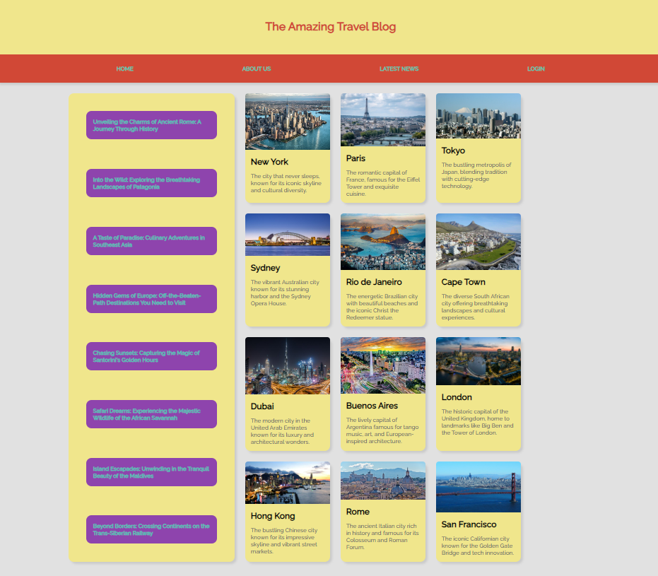

## 3E) Responsive design (5 marks)

You should make the layout change to a single column layout when the screen gets narrower.

The steps for doing this may vary depending on what approach to creating your grid layout you used.

On screens less that 1025px:

- The layout should change to a single column layout
- There should be no margin space on the left of the sidebar or card container; however, you may find there is some blank space to the right of the cards at some screen sizes due to the flex wrap property
- The sidebar should be below the card container

On screens less that 1025px, it should look something like this:

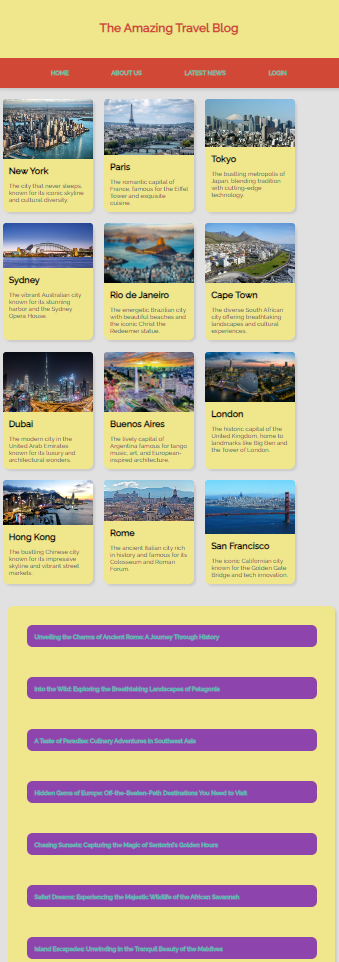

**Note:** depending on how narrow the screen gets, there could be 3, 2 or 1 cards wrapping across the card container.

If you test your page by making the screen narrower, you should notice that when there is only one card left, there is a lot of blank space to the right of the card.

For screens with a width less that 600px:

- Cards should have width 100% so they do not have blank space to their right
- The links in the nav should be positioned vertically rather than horizontally

On a very narrow screen, the layout should look something like this:

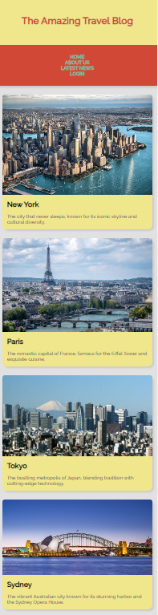

When you have finished all steps, test your page by resizing your screen and/or browser window to test what it will look like on different screen sizes.

## 3F) JavaScript (15 marks)

Think carefully how you approach this task as it will involve adding a click event listener to each card on the page. You may add extra CSS to your page to help with this task.

### Toggling background colour when clicked:

Create a JavaScript file and link it to the HTML page. Make sure to setup your page so that your code will only run after the window loads; the suggested approach is to create a window load event listener like you have used in the labs and writing your code within that.

Add JavaScript to your new file that will allow the user to click on any of the cards in the page; when any card is clicked, it will change the background colour of that card to the colour `HotPink` .

If a user clicks on many cards, the background colour of any cards that have been clicked should change to `HotPink` ; many cards can have the `HotPink` background colour at the same time.

If a user clicks a second time on any card that has been clicked on and changed to a `HotPink` background, it will change the background colour back to the normal colour `#f0e68c` that it was before being clicked. Any card should keep alternating between `HotPink` and `#f0e68c` each time it is clicked.

Think carefully about how you approach this task; there are many ways to achieve this functionality and you can take whatever approach you want. It is suggested that you consider using the adding/removing/toggling of a CSS class to add and remove the background colour.

### Resetting all background colours:

Add a new button within the nav div of the page that will allow the user to reset all background colours back to `#f0e68c` .

When the user clicks this button, all cards that have `HotPink` background colours, should return to having the normal `#f0e68c` background colour.
