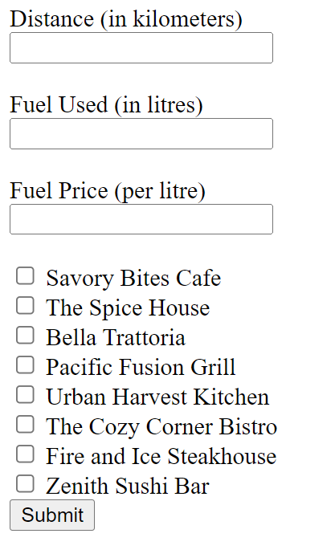
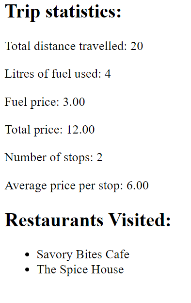

# COMPSCI 719 Practical Test Two  node.js and Handlebars

In this test, you will put in practice the knowledge you've gained in modules 6 through 9 of the course

- There are **two** questions in this practical test. Please attempt both questions. Each question is worth **25** marks, for a total of **50** marks. These marks constitute **10%** of your overall grade for COMPSCI 719.
- This is an open book test. You may use any bound printed or handwritten notes during the test. You may also use any online or PC-based resources available to you. However: **Do not** post the questions online or otherwise attempt to allow others to provide you with the answers - including your classmates and tutors! If you do this, you will be caught, you will receive 0 marks for this assessment, and you may be subject to disciplinary action.
- **Remember**: You're given `package.json` files for each question which contain all necessary dependencies. However, you will need to recreate the `node_modules` folders yourself by running the appropriate command.
- **Important:** Make sure to read all instructions and provided source code carefully before attempting each question.

Question One (25 marks):
========================

For question one, in your server-side Node.js route handler will process the form data that is submitted from `home.handlebars` and render it within a new handlebars file you create.

Spend some time looking at the form and checking you understand what will be submitted and processed.

Look carefully at the input elements in the form so you understand the structure of the data that will be submitted. You will have to do some programming with some of the data on the server-side so read the questions carefully and think about what the structure of the data coming from the form will be. Use console logs when you are unsure of the data.

This task involves processing some basic form information related to trips used to deliver ingredients to a range of restaurants. There are a few required inputs in the form relating to data related to distance, fuel, fuel price and the restaurants visited on the trip.

This is the HTML form that has been provided to you in `home.handlebars` :

When completed, the page that is generated from the submitted data should look something like this depending on what data you enter in the form:

## Step One: Processing form data in Node.js and configuring HTML form (15 marks):

In this step, you will complete the code within `question-01.js` to receive and process the data submitted from the HTML form and make it ready for Handlebars.

Here are the requirements for step one:

- The HTML form will submit to the route handler function you create
- The route handler function should process all form inputs

  - Data for distance, fuel used, fuel price and restaurants selected should all be accessed for these steps; it is suggested that you store each of these in variables so that you can easily access them as needed for calculations and displaying in Handlebars
  - You should make an array for the restaurants selected, so that even if only one restaurant is selected in the HTML form, you can still process that data as an array in Handlebars; make sure to check the code included within `question-01.js` as there is a `makeArray` utility function provided that you may use to help with this step
    - Remember to note that when only one checkbox is selected, the input will not automatically be an array, so you will need to convert it to an array
  - The total price of fuel used should be calculated based on the amount of fuel used multiplied by the fuel price; the price should be rounded to two decimal places
  - The average price per stop should be calculated by dividing the total price by the number of stops; the number of stops is the number of restaurants entered
- All data that is required to be displayed in Handlebars should be made available to Handlebars; e.g., by storing required data in `res.locals...` properties; all of this data will need to be made available to Handlebars:

  - distance travelled
  - fuel used
  - fuel price
  - total price
  - number of stops (this is the number of restaurants selected)
  - average price per stop
  - an array of restaurants visited
- Make sure that all required values are calculated and that all data is setup to be displayed in Handlebars

These are the suggested steps for completing step one:

- Create a route handler function within question-01.js with an appropriately named path and method that can handle the request from the HTML form contained in the `home.handlebars` file
  - You may choose whether you use the GET or POST method for this route handler; however, make sure that your HTML form is configured appropriately
- Edit the HTML form so it has appropriate attributes on the form element to submit to the route handler function you create
- Within your route handler function, access and process all data to meet the requirements specified above
- Setup all data to be displayed in Handlebars

## Step Two: Displaying data in Handlebars (10 marks)

In this step, you will create a new Handlebars file and complete the required Handlebars code to display the data.

When valid data from the form in input and processed, the Handlebars page should display like this:

These are the requirements for what should be displayed in Handlebars:

- Total distance travelled should be displayed
- Litres of fuel used should be displayed
- Fuel price should be displayed
- Total price of the trip should be displayed
- The number of stops should be displayed
- The average price per stop should be displayed
- The restaurants visited should be displayed in a list with bullet points
- All data should be displayed with appropriate text explaining what each value is similar to the screenshot above

The following requirements should also be implemented:

- If there are no restaurants entered, the text "No restaurants were entered" should be displayed instead of the list of restaurants
- If there are no restaurants selected, this will also mean that there are 0 stops, so the average price per stop will not calculate correctly; you should make sure that when no restaurants are selected, instead of displaying the average price per stop you should display the text "No stops were entered"
  - Note: for this step, you can choose how you structure your code to solve this step; if you wish, you may modify your JavaScript code within `question-01.js` or you may find you can just use Handlebars, but this will depend on the structure of your code
- Other than making sure to allow for the option that users may not have selected any restaurants, you can assume that all other inputs in the form will be valid positive numbers

Suggested steps for this task:

- Create an appropriately named Handlebars file to display the data processed in the server
- Add the necessary code in `question-01.js` to render the Handlebars file
- Add all necessary code to the Handlebars file to display the data as detailed above

Make sure to test your code with a range of expected inputs to check that you can process the data appropriately.

Question Two (25 marks):
========================

Take a look at the contants of the provided [`static-page`](./static-page) folder. Inside, you'll see a set of static webpages with associated CSS and image content. Open any of the files and browse through the pages using the navbar – you'll see that the content is very similar to that which you've written in early labs for this course.

Now, open the HTML files in a text editor and compare them. You'll notice that a lot of the information in the pages is the same (for example, each page has the same JavaScript / CSS links and a very similar navbar).

For this question, add **one Handlebars layout** and **three Handlebars views** (one for each of the two famous New Zealanders, and one for the "home" page) to the appropriate locations within [`question-two`](./question-one). The layout should contain as much of the structure as possible, that's currently duplicated amongst the provided HTML files, and should be called `question-two-layout.handlebars`. The views should contain the content that's specific to each page.

Once you've done that, modify [`routes/question-two-routes.js`](./question-one/routes/question-one-routes.js) to include three route handlers:

1. Navigating to [http://localhost:3000/](http://localhost:3000/) should display the home page.
2. Navigating to [http://localhost:3000/hillary](http://localhost:3000/hillary) should display the page on Edmund Hillary.
3. Navigating to [http://localhost:3000/sheppard](http://localhost:3000/sheppard) should display the page on Kate Sheppard.

You will also need a way to access the CSS and image files. Place these within the [`public`](./question-one/public) folder appropriately and add code to [`question-two.js`](./question-one/question-one.js) at the marked location which enables access to this public folder.

Once these URLs are live, make sure that the links within the website all point to the correct locations.

### Hints

1. Remember that some of the content in the HTML pages is *nearly* – but not *exactly* – identical (i.e. the highlighting of the navbar items). Consider how you can make use of appropriate Handlebars functionality to extract these parts into the main layout file.
2. Remember to test your solution to make sure the user experience is *exactly* the same as the provided sample pages.

### Marking Criteria

This question will be marked as follows:

- Appropriate HTML content is served to users: *3 marks*.
- All of the above links are functional: *4 marks*.
- All links within the app are functional: *3 marks*.
- Appropriate Handlebars layout has been created: *7 marks*.
- Images and CSS files are properly served to users: *3 marks*.
- User experience is identical to the provided sample pages: *5 marks*.
