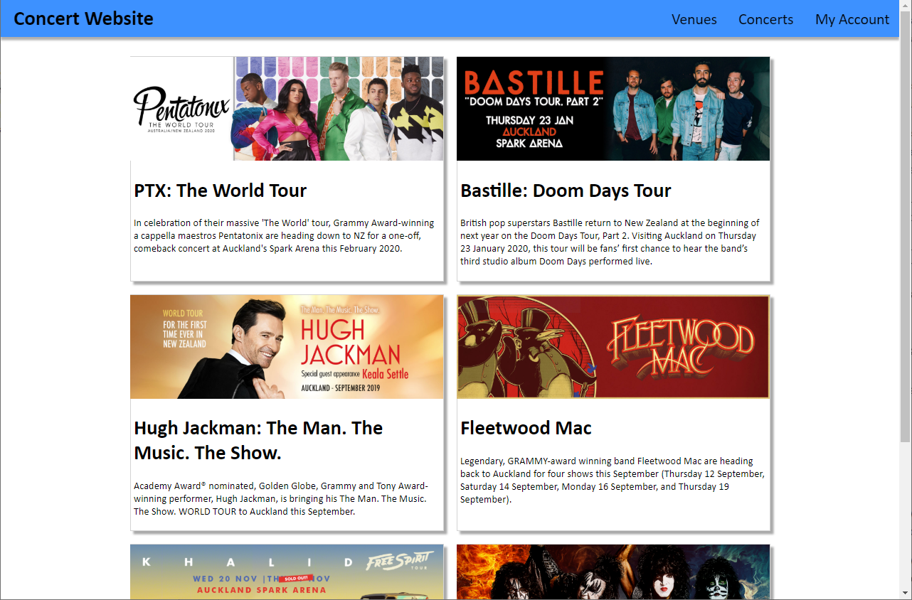
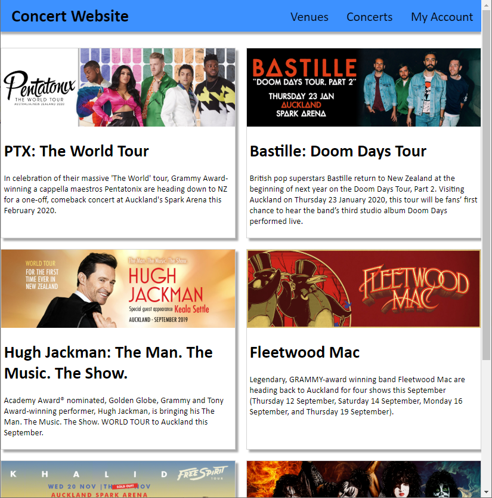
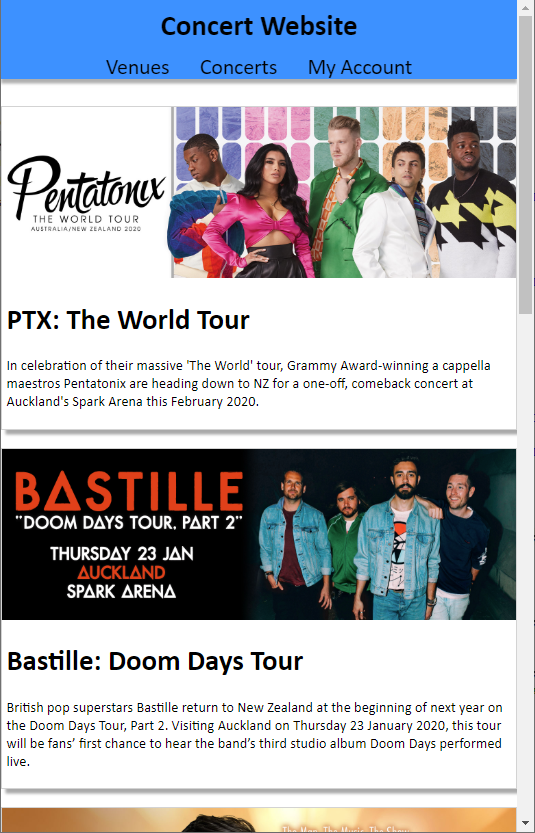
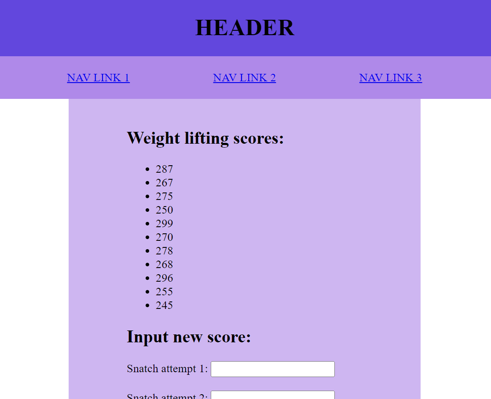
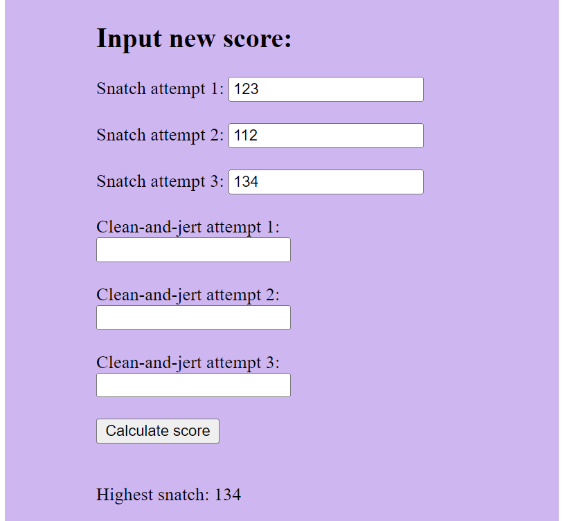
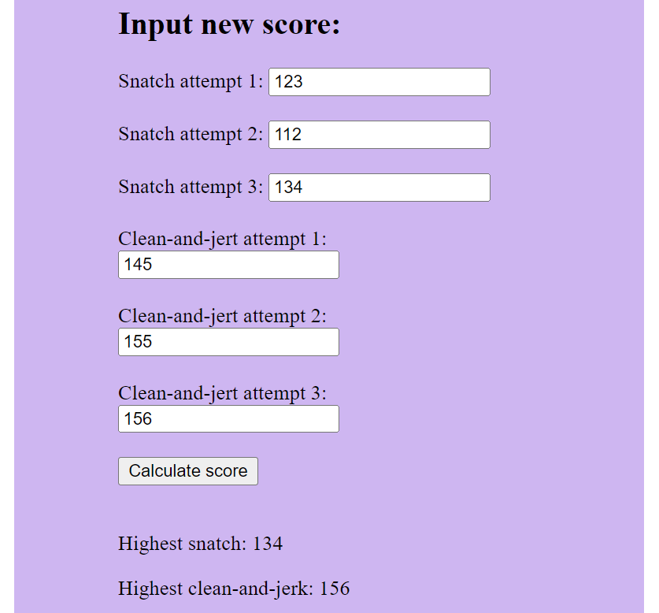
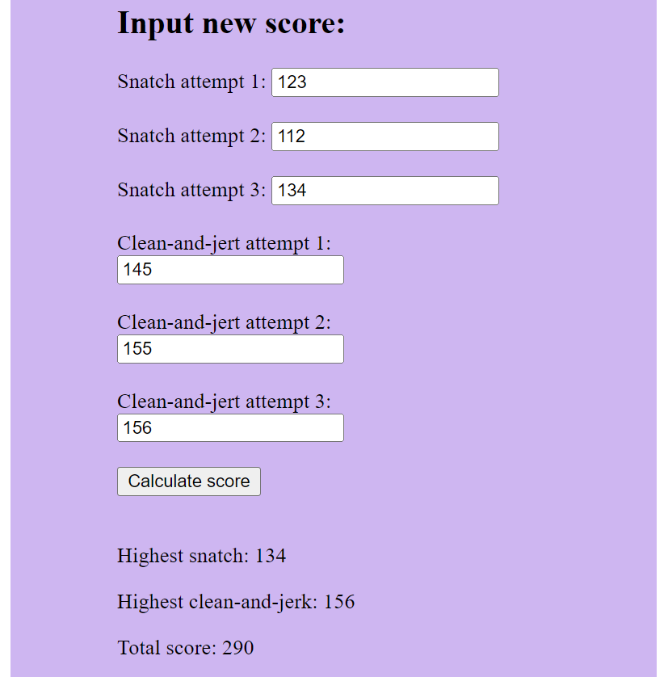
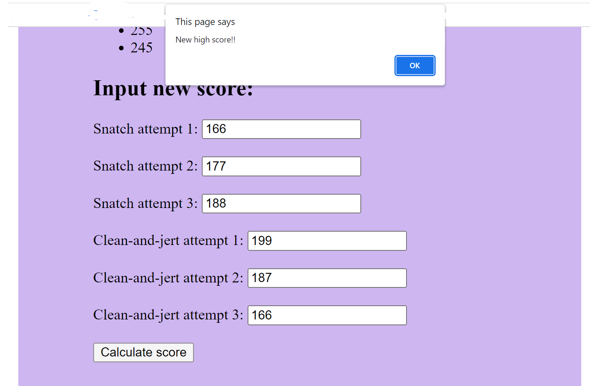

# Question One (25 marks)
In this question, we will appropriately style a webpage in a grid-style layout, then use JavaScript to add a small amount of interactivity.

Examining `question1.html`, you’ll notice that the page has several HTML elements, organized into a "navbar", and "card" `<div>`s. For the first part of this question, add CSS to `question1.css` so the page looks like the following screenshot:



## 1A) Styling (12 marks)
You should **only** edit `question1.css` for parts 1A) and 1B) unless you need to make small changes like adding an id.

To begin, apply styles to `question1.css` such that the website looks as per the above screenshot. Specifically, apply the following styles:

- *all elements* should have the Calibri font. If this is not available on a machine, then sans-serif font should be used by default.

- The `body` should have no margins.

- The `.nav` div should be `dodgerblue`, be stuck to the top of the page, and should have a 0px horizontal, 5px vertical box shadow colored as `rgba(96, 96, 96, 0.5)`. **Hint:** Investigate the CSS `box-shadow` property for this.

- The `.nav` div should lay out its child components using flexbox. Child components should be laid out in a row, with the spacing such that it is between the items, as shown in the screenshot. Child components should be centered horizontally.

- The header inside the nav should have a 10px top and bottom margin, and a 20px left and right margin.

- The spans inside the nav should have a 150% font size, 5px padding on all sides, and a 10px left and right margin.

- When the user mouses over one of the spans inside the nav, its background color should be set to `rgba(255, 255, 255, 0.5)`. The transition should occur smoothly over 0.5 seconds. A GIF of this transition can be seen in `spec/1A-animation.gif`.

- The `#container` div should have a top and bottom margin of 30px, and auto left and right margins. It should be 1000px wide.

- The `#container` div should lay out its child components using CSS grid. The grid should have two equally-sized columns, and auto rows. There should be a gap of 20px in between each grid item, both vertically and horizontally.

- The `.card` divs should have a 1px solid light gray border. In addition, they should have a dark gray box-shadow of 5px horizontally, 5px vertically.

- The `.card` divs should lay out their child components using flexbox. The flex direction should be column, and the content should be justified at the start.

- The `.card-image` images should have a width of 100%, and should have the following property set so that they maintain their aspect ratio when resized:

  ```css
  object-fit: cover;
  ```
- The `.card-body` divs should have a 5px margin on the bottom, left, and right.

## 1B) Responsiveness (7 marks)
Further style your design such that it is responsive. Specifically, apply the following styles:

- When viewing your webpage on a screen of size 1100px or less, the width of the container should be changed to 100%, and its left and right margins should be removed, as shown in the following screenshot:

  

- When viewing your webpage on a screen of size 800px or less, the container's grid should additionally be changed to have only one column. in addition, the navbar should change to a column layout, and should vertically and horizontally center its children. This can be seen in the following screenshot:

  
  
## 1C) Interaction with cards (6 marks)
You may **only** edit `question1.js` for part 1C). **Do not edit any other files!**

Finally, add JavaScript to your page so that users are visually notified when they have clicked on a card. Specifically, add code such that whenever the user clicks on one of the `.card` divs, its background color changes to `dodgerblue`, and *all other* card divs change back to their default background color. A GIF of this interaction can be seen in `spec/1C-animation.gif`.


# Question Two (25 marks)

For this question you have been provided with three files: HTML, CSS and JavaScript.

This question involves working in the JavaScript file; you should not need to edit any of the HTML and CSS.

This question has several steps. The first step involves displaying an existing array of scores on the page when the page loads. Later steps involve calculating new values based on user inputs and then adding the newly calculated score to the existing `scores` array and displaying it on screen.

The specifics of how you write the code is up to you; however, you may find that if you use functions carefully, you can more efficiently complete some of the following steps.

## Code style (2 marks)

2 marks for this question will be awarded for good code style. This will be based on whether use generally good structure and whether you write your code efficiently to avoid unnecessary repetition. There are a few times in the following steps where you can avoid repeating similar steps by using functions. You can also use loops to efficiently iterate over items in arrays/lists to avoid writing repetitious references to individual items in arrays of data or elements.

## 2A) Displaying the existing scores (5 marks)

Examine the JavaScript file that you have been provided. It has an array called `scores` that has some scores that should display in the page when the page loads.

For this step, you will display the scores from the `scores` array as list items within the `ul` element in the page. Look at the HTML file to see that the `ul` element has an `id` attribute that you can use. When the page loads, all of these scores should display as list items.

The suggested steps are: 
- Loop through the `scores` array
- Create an HTML `li` element on the page for each score that will display the value

You can use any method for creating the elements; i.e., you can do it via the `innerHTML` property of the parent element or through `createElement`+`appendChild`.

When you have completed this step, it should look something like this:



### Note: 

The next steps involve code that should be executed when the user clicks the `Calculate score` button. Because all of these steps should happen everytime the button is clicked, you should write the code for the following steps within the `click` event listener or within functions that are called from within the `click` event listener. It is you choice whether you choose to write functions to help implement the following steps. 


## 2B) Calculating the highest snatch (3 marks)

Create a `click` event listener for when the user clicks the `Calculate score` button. There are several things will happen when this button is clicked. You can write the code that happens after this `click` event within the `click` event listener to ensure that it will only run when the button is clicked; you may wish to write extra functions to help with some of these steps.

When the user clicks the `Calculate score` button, the highest snatch should be calculated from the three snatch input elements. 

The highest of the three snatch input values should then be displayed in the `Highest snatch` span element.

When you complete this step, it should look something like this after the button is clicked: 



## 2C) Calculating the highest clean-and-jerk (3 marks)

When the `Calculate score` button is clicked, the highest clean-and-jerk should also be calculated. This value should be the highest value from the three clean-and-jerk input elements.

That value should then be displayed in the `Highest clean-and-jerk` span element. 

When you complete this step, it should look something like this after the button is clicked: 



## 2D) Calculating the total score (4 marks)

The total score in weight lifting is the combination of the highest snatch and the highest clean-and-jerk.

When the `Calculate score` button is clicked and after the highest snatch and highest clean-and-jerk are calculated, the total score should be calculated and displayed in the `Total score` span element. 

To calculate the total score, you should add the highest snatch and the highest clean-and-jerk values together. 

After the value is calculated, you should display it in the `Total score` span element.

Once you have completed your code, test it to make sure that the correct values display for the highest snatch, highest clean-and-jerk and the total score. 

When you complete this step, it should look something like this after the button is clicked: 



## 2E) Adding the newly calculated score to the existing scores array & list (4 marks)

Now that you have calculated the new total score from the 6 user inputs (3 snatch & 3 clean-and-jerk), you should add the total score to the JavaScript `scores` array and update the list displayed in the HTML page to include the newly generated score as well as the existing scores. 

Think carefully about how you implement this step. You can add the newly calculated score to the `scores` array in JavaScript and use the updated `scores` array to regenerate the list items within the `ul` element the same way you generated them when the page initially loaded. 

Remember that if you are regenerating the list items within the `ul` element based on the updated array in JavaScript, you will want to clear the existing list items from the `ul` element before regenerating the new list items. 

Hint: you can clear all HTML content from an element by setting its innerHTML property to be empty; i.e., `innerHTML = ""`

When you complete this step, the newly calculated score should appear in both the `Total score` span and in the list; it should look something like this after the button is clicked: 


## 2D) Notifying the user of a new top score (4 marks)

Now write code that will check if a newly calculated score is higher than all existing scores. If it is higher than all existing scores, the user should be informed via an alert message that they have a `"New high score!"`.

It is up to you how you implement this step and there are multiple approaches that would work. Plan your approach carefully and think about the best order in which to implement these steps.

When you complete this step, if it is a new high score, it should look something like this after the button is clicked: 

